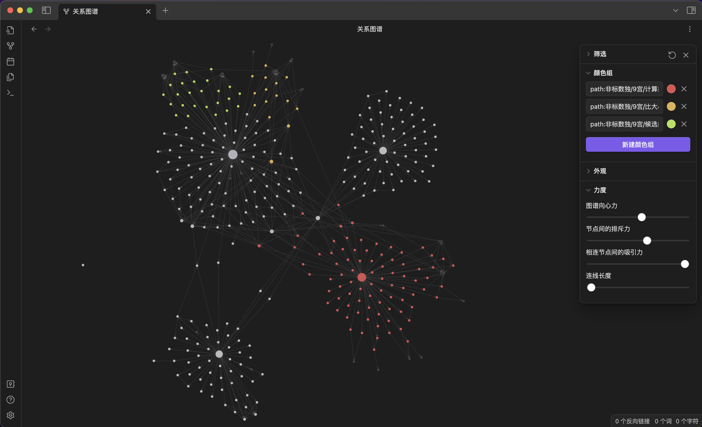

# 数独资源

收录数独资源

- 根据标准数独、非标准数独进行分类
- 便于查找各类异形数独

## 查看方式

### GitHub

访问 [目录索引](SUMMARY.md)

### 脑图

访问 [数独资源与分类](http://naotu.baidu.com/file/825e8b6bb24556bf904887a36158afcd?token=2739364acfe6d714)

### Gitbook

- [在线版](https://zhugelianglongming.gitbook.io/shu-du/)
- 离线版
    1. clone 代码，并启动 gitbook

        ```shell
        git clone git@github.com:zhugelianglongming/sudoku.git
        cd sudoku
        gitbook serve
        ```

    2. 访问 [localhost:4000](http://localhost:4000) 查看

### Obsidian

以关联知识图谱的方式查看：

- 下载并安装 [Obsidian](https://obsidian.md/)
- 下载代码库 `git clone git@github.com:zhugelianglongming/sudoku.git`
- 点击`打开本地仓库`，选择代码库本地根目录
- 点击`查看关系图谱`



## 收录

### 站点

- 博客
  - [谜者老芦的博客](http://blog.sina.com.cn/u/1752936301)
  - [逍遥的博客](http://blog.sina.com.cn/iae3ng)
  - [真笑天天的博客](http://blog.sina.com.cn/zhenxiaott)
- [聪明方格](https://cn.newdoku.com/)
- [独·数之道](http://www.sudokufans.org.cn/)
- [今日数独](https://cn.sudoku.today/)
- [康思](https://www.conceptispuzzles.com/zh/index.aspx)
- [欧泊颗](https://p.oubk.com/)
- [三思](https://www.12634.com/)
- [杀手数独](https://cn.puzzle-killer-sudoku.com/)
- [数独在线](https://sudoku-cn.com/)
- [数独 puzzle-sudoku.com](https://cn.puzzle-sudoku.com/)
- [数独 sudoku.name](https://www.sudoku.name/index-cn.php)
- [数独 Sudoku Game](http://www.sudokugame.org/)
- [数和](https://cn.puzzle-kakuro.com/)
- [武士数独](https://cn.samuraisudoku.com/)
- [异形数独](https://cn.puzzle-jigsaw-sudoku.com/)
- [有一个数独](https://shudu.one/)
- [Daily Killer Sudoku](https://www.dailykillersudoku.com/)
- [Fun With Puzzles](https://www.funwithpuzzles.com/)
- [Futoshiki](https://cn.puzzle-futoshiki.com/)
- [Grandmaster Puzzles](https://www.gmpuzzles.com/)
- [Logic Masters Deutschland e.V.](https://logic-masters.de/)
- [Killer Sudoku Online](https://www.killersudokuonline.com/)
- [krazydad](https://krazydad.com/)
- [Simon Tatham's Portable Puzzle Collection](https://www.chiark.greenend.org.uk/~sgtatham/puzzles/)
- [SUDOKU.HK](https://sudoku.hk/)
- [Sudoku.com](https://sudoku.com/zh)
- [Sudoku Kingdom](https://sudokukingdom.com/)
- [Sudoku Puzzle](https://cn.sudokupuzzle.org/)

#### 微信小程序

> 复制右侧链接，可在微信中直接打开小程序

- 三思数独 `#小程序://三思数独/gUu4UIUAgfF0AOq`
- 鳄鱼数独 `#小程序://鳄鱼数独/LZm0WknUKhpMrbc`
- 肯肯数谜数独 `#小程序://肯肯数谜数独/肯肯数独/6JRdmdOXDFZGOHD`
- 口袋数独 `#小程序://口袋数独/VjGS3AhQ0Oy9Ufk`
- 联网数独 `#小程序://联网数独/联网数独/RWMGoumiDkGZHQb`
- 破解数独 `#小程序://破解数独/破解数独/6Oj6WLfkbkJiyhw`
- 数独大乱斗 `#小程序://数独大乱斗/首页/0MTBL5MtvmFrQPG`
- 数独每日一题 `#小程序://数独每日一题/百人赛/WxK6JOaAgIc3Z5b`
- 数独谜题 `#小程序://数独谜题/5EMzvlmHZpwu0Pl`
- 数独天地 `#小程序://数独天地/YBEeJaP6IJVoipx`
- 数独星空 `#小程序://数独星空/TYOXr9SLNGQlDmx`
- 我爱玩数独 `#小程序://玩数独/fUS6ycOThsmz4jB`
- ~~变形数独 `#小程序://变形数独/高端数独/3QQ2xclTUJ6u2bc`~~
