# 常见规则说明
<!-- START doctoc generated TOC please keep comment here to allow auto update -->
<!-- DON'T EDIT THIS SECTION, INSTEAD RE-RUN doctoc TO UPDATE -->
## 目录

- [共边平行路](#%E5%85%B1%E8%BE%B9%E5%B9%B3%E8%A1%8C%E8%B7%AF)
  - [棱](#%E6%A3%B1)
- [上斜线](#%E4%B8%8A%E6%96%9C%E7%BA%BF)
  - [上对角线](#%E4%B8%8A%E5%AF%B9%E8%A7%92%E7%BA%BF)
- [下斜线](#%E4%B8%8B%E6%96%9C%E7%BA%BF)
  - [下对角线](#%E4%B8%8B%E5%AF%B9%E8%A7%92%E7%BA%BF)
- [对角线](#%E5%AF%B9%E8%A7%92%E7%BA%BF)
  - [对角线约束](#%E5%AF%B9%E8%A7%92%E7%BA%BF%E7%BA%A6%E6%9D%9F)
  - [反对角线约束](#%E5%8F%8D%E5%AF%B9%E8%A7%92%E7%BA%BF%E7%BA%A6%E6%9D%9F)
- [1to9填充](#1to9%E5%A1%AB%E5%85%85)
- [1toG填充](#1tog%E5%A1%AB%E5%85%85)
- [1to8填充](#1to8%E5%A1%AB%E5%85%85)
- [1to6填充](#1to6%E5%A1%AB%E5%85%85)
- [9选6填充](#9%E9%80%896%E5%A1%AB%E5%85%85)
- [全盘9选6填充](#%E5%85%A8%E7%9B%989%E9%80%896%E5%A1%AB%E5%85%85)
- [1to9不重复](#1to9%E4%B8%8D%E9%87%8D%E5%A4%8D)
- [1to8不重复](#1to8%E4%B8%8D%E9%87%8D%E5%A4%8D)
- [0to9不重复](#0to9%E4%B8%8D%E9%87%8D%E5%A4%8D)
- [摩天楼](#%E6%91%A9%E5%A4%A9%E6%A5%BC)
- [摩天楼观测数](#%E6%91%A9%E5%A4%A9%E6%A5%BC%E8%A7%82%E6%B5%8B%E6%95%B0)
- [摩天和](#%E6%91%A9%E5%A4%A9%E5%92%8C)
- [邻格](#%E9%82%BB%E6%A0%BC)
  - [共边邻格](#%E5%85%B1%E8%BE%B9%E9%82%BB%E6%A0%BC)
  - [对角邻格](#%E5%AF%B9%E8%A7%92%E9%82%BB%E6%A0%BC)
- [连续](#%E8%BF%9E%E7%BB%AD)
  - [正交连续](#%E6%AD%A3%E4%BA%A4%E8%BF%9E%E7%BB%AD)
  - [斜连续](#%E6%96%9C%E8%BF%9E%E7%BB%AD)
- [黑白点](#%E9%BB%91%E7%99%BD%E7%82%B9)
- [数比](#%E6%95%B0%E6%AF%94)
- [无缘](#%E6%97%A0%E7%BC%98)
- [士步](#%E5%A3%AB%E6%AD%A5)
- [马步](#%E9%A9%AC%E6%AD%A5)
  - [马步约束](#%E9%A9%AC%E6%AD%A5%E7%BA%A6%E6%9D%9F)
  - [马步中心](#%E9%A9%AC%E6%AD%A5%E4%B8%AD%E5%BF%83)
- [象步](#%E8%B1%A1%E6%AD%A5)
- [前X和](#%E5%89%8Dx%E5%92%8C)
- [边框和](#%E8%BE%B9%E6%A1%86%E5%92%8C)
- [奇偶星](#%E5%A5%87%E5%81%B6%E6%98%9F)
- [骨牌](#%E9%AA%A8%E7%89%8C)
  - [1to9骨牌填充](#1to9%E9%AA%A8%E7%89%8C%E5%A1%AB%E5%85%85)

<!-- END doctoc generated TOC please keep comment here to allow auto update -->

## 共边平行路

一个区域内，所有邻格的公共边互相平行
> 此类区域形似石板铺成的"路"

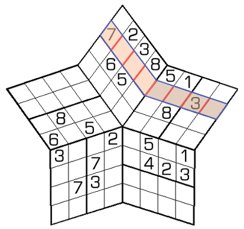

### 棱

魔方中的[共边平行路]

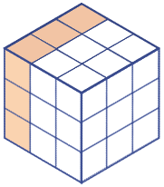

- 棱的编号
  - 方向：`左`，`右`，`下`
  - 数字：从中心点向外，分别为 1,2,3...

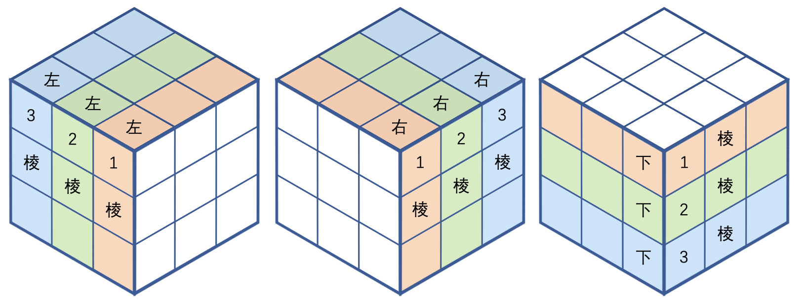

## 上斜线

左下到右上的斜线区域

### 上对角线

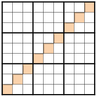

## 下斜线

左上到右下的斜线区域

### 下对角线

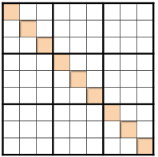

## 对角线

经过天元，连接对角的区域。
主要包括：

- [上对角线]
- [下对角线]
- 弯对角线

### 对角线约束

对角线上的数字不重复。
> 对于 9 阶数独，对角线满足：区域内[1~9填充]

### 反对角线约束

对角线上的数字必重复。
> 对于 9 阶数独，反对角线满足：区域内仅有 3 种数字

## 1to9填充

- 单一区域内填入 `1-9`
- 每个数字恰好出现 1 次。

## 1toG填充

- 单一区域内填入 `1-9A-G`
- 每个字符恰好出现 1 次。

## 1to8填充

- 单一区域内填入 `1-8`
- 每个数字恰好出现 1 次。

## 1to6填充

- 单一区域内填入 `1-6`
- 每个数字恰好出现 1 次。

## 9选6填充

- 在 `1-9` 中挑选 6 个数，单一区域内填入
- 每个数字恰好出现 1 次。

## 全盘9选6填充

在 `1-9` 中挑选 6 个数，全盘仅出现这 6 种不同的数字。

## 1to9不重复

- 单一区域内填入 `1-9`
- 每个数字出现 0 或 1 次。

## 1to8不重复

- 单一区域内填入 `1-8`
- 每个数字出现 0 或 1 次。

## 0to9不重复

- 单一区域内填入 `0-9`
- 每个数字出现 0 或 1 次。

## 摩天楼

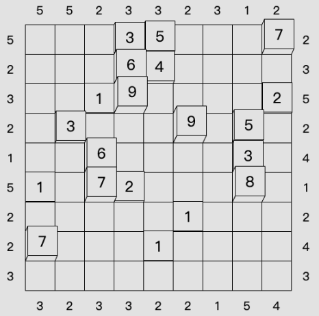

摩天楼规则需要一定的空间想象力，对以下内容进行对应理解：

- 数独盘面 → 平地
- 数独盘面内的数字 → 位于该位置上的楼的层数
- 9 宫摩天楼数独的解 → 平地上有 `81`栋高低不同的楼，其中 9 层高的楼有 `9` 栋，8 层高的楼有 `9` 栋，...，1 层高的楼也有 `9` 栋
- 摩天楼观测提示数 → 从提示数所在（观测位，观测方向）上，可以看到的楼栋数（即[摩天楼观测数](#摩天楼观测数)）
- 摩天和提示数 → 从提示数所在（观测位，观测方向）上，可以看到的部分楼，[摩天和](#摩天和)是这些楼的总层数

> 注意：存在高楼挡住矮楼，导致矮楼无法被看到的情况。

## 摩天楼观测数

在摩天楼数独规则下，在指定（观测位，观测方向）上，可以看到 N 栋楼。`摩天楼观测数`是可以看到的楼栋数，即`N`。

## 摩天和

在摩天楼数独规则下，在指定（观测位，观测方向）上，可以看到 N 栋楼。`摩天和`是这 N 栋楼的层数总和。

> 举例：
>
> - 盘面信息：
>   - A 行的数字从左到右为：381654729
>   - 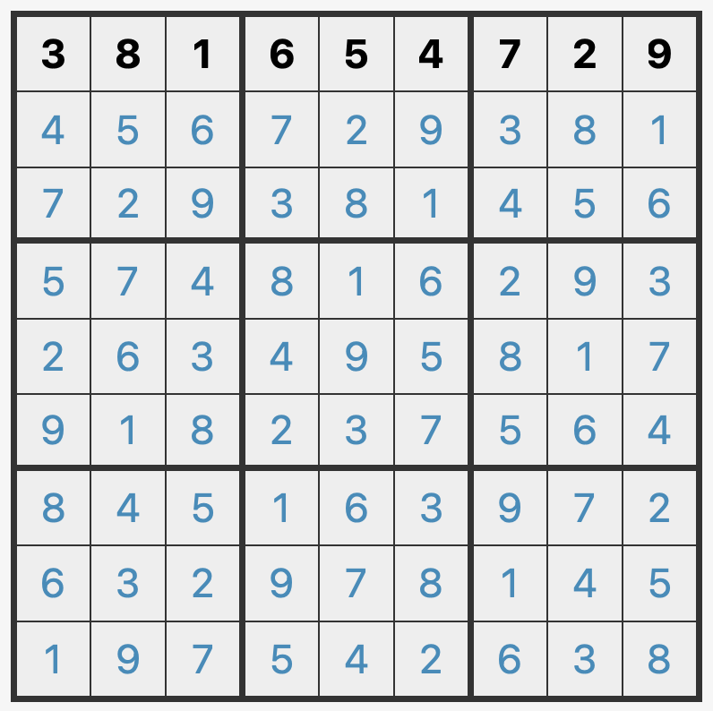
> - 观测信息：
>   - 从 `A0`（A1 左侧），向右观测
>   - 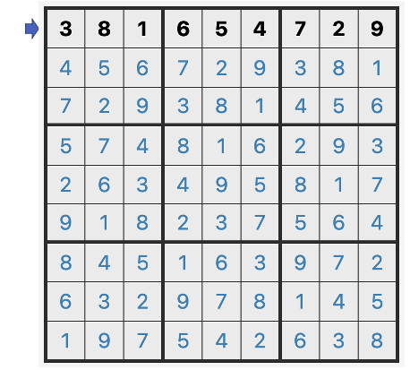
> - 观测结果：可以看到 `3` 栋楼，分别是 3 层楼（`A1`）、8 层楼(`A2`)、9 层楼(`A9`)
>   - `A1`(3层楼)：可以看到
>   - `A2`(8层楼)：可以看到，8 层楼高于 3 层楼（8>3）
>   - `A3`(1层楼)：无法看到，被 8 层楼挡住（1<8）
>   - `A4`(6层楼)：无法看到，被 8 层楼挡住（6<8）
>   - `A5`(5层楼)：无法看到，被 8 层楼挡住（5<8）
>   - `A6`(4层楼)：无法看到，被 8 层楼挡住（4<8）
>   - `A7`(7层楼)：无法看到，被 8 层楼挡住（7<8）
>   - `A8`(2层楼)：无法看到，被 8 层楼挡住（2<8）
>   - `A9`(9层楼)：可以看到，9 层楼高于 8 层楼（9>8）
>   - 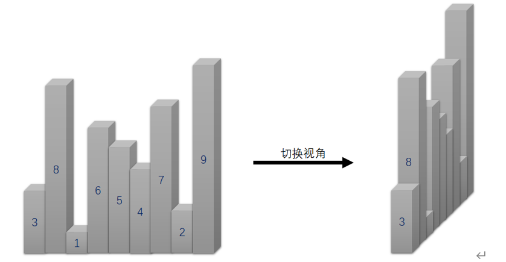
> - 结论：此例中，`A0` 位向右观测的
>   - `摩天楼观测数` 是 `3`
>   - `摩天和` 是 `20`=3+8+9
>   - 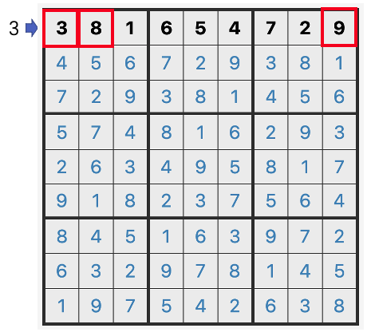

## 邻格

两格拥有公共的点，则互为`邻格`。

对于标准 9 宫数独：

- `A1`,`A9`,`I1`,`I9`：有 3 个邻格
- `{A,I}{2-8}`，`{B-H}{1,9}`：有 5 个邻格
- `{B-H}{2-8}`：有 8 个邻格

### 共边邻格

两格拥有公共的边，则互为`共边邻格`。

对于标准 9 宫数独：

- `A1`,`A9`,`I1`,`I9`：有 2 个共边邻格
- `{A,I}{2-8}`，`{B-H}{1,9}`：有 3 个共边邻格
- `{B-H}{2-8}`：有 4 个共边邻格

### 对角邻格

两格拥有公共的点，但不存在公共的边，则互为`对角邻格`。

对于标准 9 宫数独：

- `A1`,`A9`,`I1`,`I9`：有 1 个对角邻格
- `{A,I}{2-8}`，`{B-H}{1,9}`：有 2 个对角邻格
- `{B-H}{2-8}`：有 4 个对角邻格

> `对角邻格` 等价与 [士步格]

## 连续

如果两格满足`连续`约束，说明这两格数字差为 1

### 正交连续

如果[共边邻格]的公共边上存在标记，说明这两格数字差为 1

### 斜连续

如果[对角邻格]的公共顶点上存在标记，说明这两格数字差为 1

## 黑白点

如果[共边邻格]的公共边上存在黑白点标记，说明这两格数字大小满足：

- 黑点：两格数字是两格关系
- 白点：两格数字差为 1（即[连续]）

> 注意：`1`和`2`之间可能标记黑点，也可能标记白点

## 数比

两格之间存在大小标志，说明这两个数字满足以下情况之一：

- `=`：两格数字相同
- `>`：开口方向格 大于 闭口方向格
- `⊿`：斜边所在格 大于 直角方向格

## 无缘

对于数字 `A`：

- 盘面内任意一个数字`A`，它的[邻格]都不是数字 `A`

> 在标准数独中，等价于：
>
> - 盘面内任意一个数字`A`，它的[对角邻格]都不是数字 `A`
> - 盘面内任意一个数字`A`，它的[士步格]都不是数字 `A`

## 士步

两格的横向距离和纵向距离都是`1`，则互为`士步`格。

> `士步格`等价与 [对角邻格]

## 马步

两格的横向距离和纵向距离，一个是`1`，一个是`2`，则互为`马步`格。

对于标准 9 宫数独：

- `A1`,`A9`,`I1`,`I9`：有 2 个马步格
- `{A,I}{2,8}`，`{B,H}{1,9}`：有 3 个马步格
- `B2`,`B8`,`H2`,`H8`,`{A,I}{3-7}`，`{C-G}{1,9}`：有 4 个马步格
- `{B,H}{3-7}`，`{C-G}{2,8}`：有 6 个马步格
- `{C-G}{3-7}`：有 8 个马步格

### 马步约束

两格互为[马步格]，且数字相同

### 马步中心

互为[马步]的两格的中点

## 象步

两格的横向距离和纵向距离都是`2`，则互为`象步`格。

对于标准 9 宫数独：

- `{A,B,H,I}{1,2,8,9}`: 有 1 个象步格
- `{A,B,H,I}{3-7}`，`{C-G}{1,2,8,9}`：有 2 个象步格
- `{C-G}{3-7}`：有 4 个象步格

## 前X和

盘外提示数 S：当前位置向盘内看，第 1 格为`X`，前 X 格和为`S`

## 边框和

盘外提示数 S: 当前位置向盘内看，前 3 格的和为 `S`

## 奇偶星

- 区域：中心格 及其[共边邻格]，一般标记中心格
- 限制：中心格与其[共边邻格]奇偶性相反

> 引用：
>
> - BiliBili：[15：摩天楼数独](https://www.bilibili.com/read/cv10181180)

## 骨牌

1 个骨牌占据 1 宫，每个骨牌包含 1-9 个骨牌点。

骨牌 `1`~`9`如下图所示：
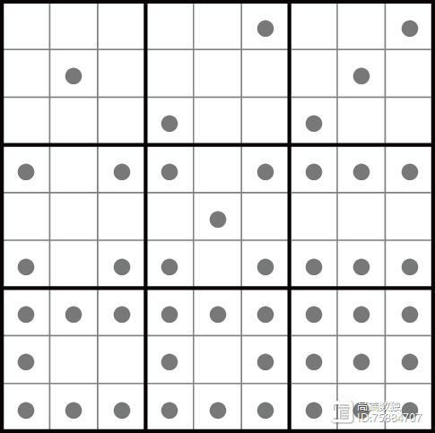

### 1to9骨牌填充

- 全盘填入 `1-9` 骨牌
- 每个骨牌恰好出现 1 次。

[共边邻格]: #共边邻格

[对角邻格]: #对角邻格

[邻格]: #邻格

[连续]: #连续

[共边平行路]: #共边平行路

[士步格]: #士步

[马步格]: #马步

[马步]: #马步

[上对角线]: #上对角线

[下对角线]: #下对角线

[1~9填充]: #1to9填充
