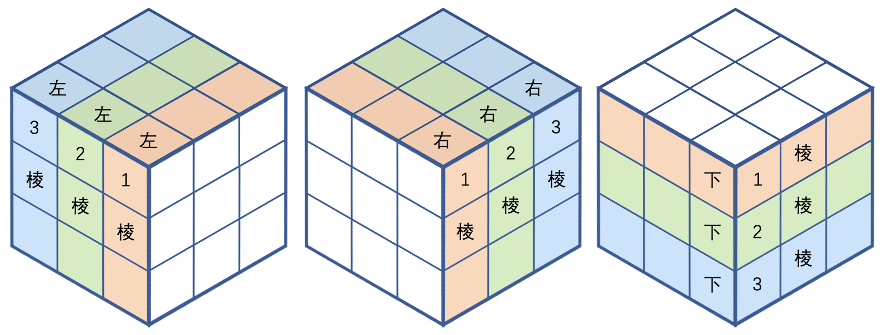
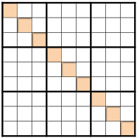
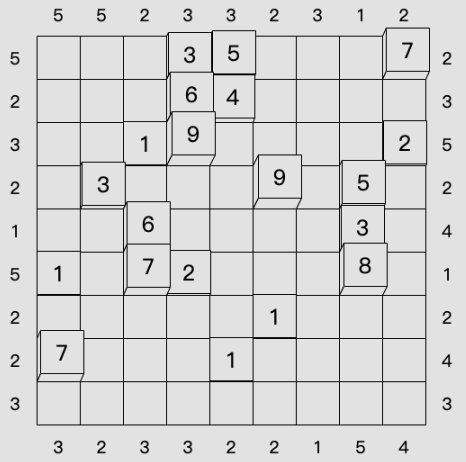
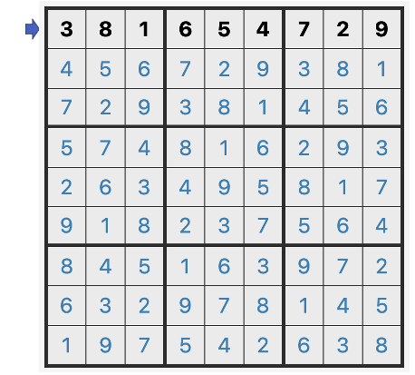
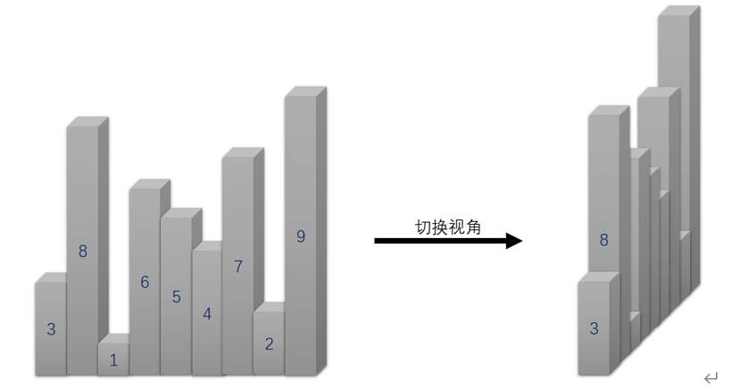
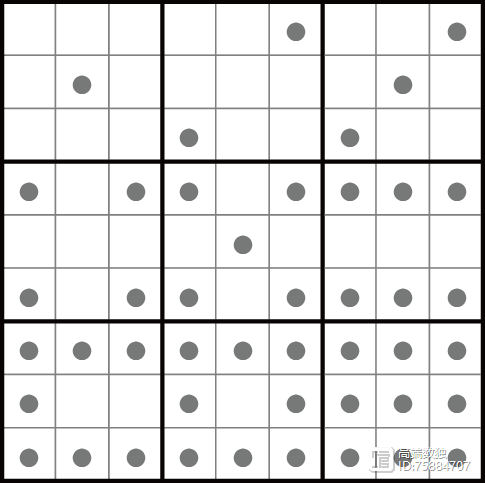

# 常见规则说明
<!-- START doctoc generated TOC please keep comment here to allow auto update -->
<!-- DON'T EDIT THIS SECTION, INSTEAD RE-RUN doctoc TO UPDATE -->

<!-- END doctoc generated TOC please keep comment here to allow auto update -->

## 共边平行路

一个区域内，所有邻格的公共边互相平行
> 此类区域形似石板铺成的"路"

### 棱

魔方中的[共边平行路]

- 棱的编号
  - 方向：`左`，`右`，`下`
  - 数字：从中心点向外，分别为 1,2,3...

## 上斜线

左下到右上的斜线区域

### 上对角线

## 下斜线

左上到右下的斜线区域

### 下对角线

## 对角线

经过天元，连接对角的区域。
主要包括：

- [上对角线]
- [下对角线]
- 弯对角线

### 对角线约束

对角线上的数字不重复。
> 对于 9 阶数独，对角线满足：区域内[1~9填充]

### 反对角线约束

对角线上的数字必重复。
> 对于 9 阶数独，反对角线满足：区域内仅有 3 种数字

## 1to9填充

- 单一区域内填入 `1-9`
- 每个数字恰好出现 1 次。

## 1toG填充

- 单一区域内填入 `1-9A-G`
- 每个字符恰好出现 1 次。

## 1to8填充

- 单一区域内填入 `1-8`
- 每个数字恰好出现 1 次。

## 1to6填充

- 单一区域内填入 `1-6`
- 每个数字恰好出现 1 次。

## 9选6填充

- 在 `1-9` 中挑选 6 个数，单一区域内填入
- 每个数字恰好出现 1 次。

## 全盘9选6填充

在 `1-9` 中挑选 6 个数，全盘仅出现这 6 种不同的数字。

## 1to9不重复

- 单一区域内填入 `1-9`
- 每个数字出现 0 或 1 次。

## 1to8不重复

- 单一区域内填入 `1-8`
- 每个数字出现 0 或 1 次。

## 0to9不重复

- 单一区域内填入 `0-9`
- 每个数字出现 0 或 1 次。

## 摩天楼

摩天楼规则需要一定的空间想象力，对以下内容进行对应理解：

- 数独盘面 → 平地
- 数独盘面内的数字 → 位于该位置上的楼的层数
- 9 宫摩天楼数独的解 → 平地上有 `81`栋高低不同的楼，其中 9 层高的楼有 `9` 栋，8 层高的楼有 `9` 栋，...，1 层高的楼也有 `9` 栋
- 摩天楼观测提示数 → 从提示数所在（观测位，观测方向）上，可以看到的楼栋数（即[摩天楼观测数](#摩天楼观测数)）
- 摩天和提示数 → 从提示数所在（观测位，观测方向）上，可以看到的部分楼，[摩天和](#摩天和)是这些楼的总层数

> 注意：存在高楼挡住矮楼，导致矮楼无法被看到的情况。

## 摩天楼观测数

在摩天楼数独规则下，在指定（观测位，观测方向）上，可以看到 N 栋楼。`摩天楼观测数`是可以看到的楼栋数，即`N`。

## 摩天和

在摩天楼数独规则下，在指定（观测位，观测方向）上，可以看到 N 栋楼。`摩天和`是这 N 栋楼的层数总和。

> 举例：
>
> - 盘面信息：
>   - A 行的数字从左到右为：381654729
>   - 
> - 观测信息：
>   - 从 `A0`（A1 左侧），向右观测
>   - 
> - 观测结果：可以看到 `3` 栋楼，分别是 3 层楼（`A1`）、8 层楼(`A2`)、9 层楼(`A9`)
>   - `A1`(3层楼)：可以看到
>   - `A2`(8层楼)：可以看到，8 层楼高于 3 层楼（8>3）
>   - `A3`(1层楼)：无法看到，被 8 层楼挡住（1<8）
>   - `A4`(6层楼)：无法看到，被 8 层楼挡住（6<8）
>   - `A5`(5层楼)：无法看到，被 8 层楼挡住（5<8）
>   - `A6`(4层楼)：无法看到，被 8 层楼挡住（4<8）
>   - `A7`(7层楼)：无法看到，被 8 层楼挡住（7<8）
>   - `A8`(2层楼)：无法看到，被 8 层楼挡住（2<8）
>   - `A9`(9层楼)：可以看到，9 层楼高于 8 层楼（9>8）
>   - 
> - 结论：此例中，`A0` 位向右观测的
>   - `摩天楼观测数` 是 `3`
>   - `摩天和` 是 `20`=3+8+9
>   - 

## 邻格

两格拥有公共的点，则互为`邻格`。

对于标准 9 宫数独：

- `A1`,`A9`,`I1`,`I9`：有 3 个邻格
- `{A,I}{2-8}`，`{B-H}{1,9}`：有 5 个邻格
- `{B-H}{2-8}`：有 8 个邻格

### 共边邻格

两格拥有公共的边，则互为`共边邻格`。

对于标准 9 宫数独：

- `A1`,`A9`,`I1`,`I9`：有 2 个共边邻格
- `{A,I}{2-8}`，`{B-H}{1,9}`：有 3 个共边邻格
- `{B-H}{2-8}`：有 4 个共边邻格

### 对角邻格

两格拥有公共的点，但不存在公共的边，则互为`对角邻格`。

对于标准 9 宫数独：

- `A1`,`A9`,`I1`,`I9`：有 1 个对角邻格
- `{A,I}{2-8}`，`{B-H}{1,9}`：有 2 个对角邻格
- `{B-H}{2-8}`：有 4 个对角邻格

> `对角邻格` 等价与 [士步格]

## 连续

如果两格满足`连续`约束，说明这两格数字差为 1

### 正交连续

如果[共边邻格]的公共边上存在标记，说明这两格数字差为 1

### 斜连续

如果[对角邻格]的公共顶点上存在标记，说明这两格数字差为 1

## 黑白点

如果[共边邻格]的公共边上存在黑白点标记，说明这两格数字大小满足：

- 黑点：两格数字是两格关系
- 白点：两格数字差为 1（即[连续]）

> 注意：`1`和`2`之间可能标记黑点，也可能标记白点

## 数比

两格之间存在大小标志，说明这两个数字满足以下情况之一：

- `=`：两格数字相同
- `>`：开口方向格 大于 闭口方向格
- `⊿`：斜边所在格 大于 直角方向格

## 无缘

对于数字 `A`：

- 盘面内任意一个数字`A`，它的[邻格]都不是数字 `A`

> 在标准数独中，等价于：
>
> - 盘面内任意一个数字`A`，它的[对角邻格]都不是数字 `A`
> - 盘面内任意一个数字`A`，它的[士步格]都不是数字 `A`

## 士步

两格的横向距离和纵向距离都是`1`，则互为`士步`格。

> `士步格`等价与 [对角邻格]

## 马步

两格的横向距离和纵向距离，一个是`1`，一个是`2`，则互为`马步`格。

对于标准 9 宫数独：

- `A1`,`A9`,`I1`,`I9`：有 2 个马步格
- `{A,I}{2,8}`，`{B,H}{1,9}`：有 3 个马步格
- `B2`,`B8`,`H2`,`H8`,`{A,I}{3-7}`，`{C-G}{1,9}`：有 4 个马步格
- `{B,H}{3-7}`，`{C-G}{2,8}`：有 6 个马步格
- `{C-G}{3-7}`：有 8 个马步格

### 马步约束

两格互为[马步格]，且数字相同

### 马步中心

互为[马步]的两格的中点

## 象步

两格的横向距离和纵向距离都是`2`，则互为`象步`格。

对于标准 9 宫数独：

- `{A,B,H,I}{1,2,8,9}`: 有 1 个象步格
- `{A,B,H,I}{3-7}`，`{C-G}{1,2,8,9}`：有 2 个象步格
- `{C-G}{3-7}`：有 4 个象步格

## 前X和

盘外提示数 S：当前位置向盘内看，第 1 格为`X`，前 X 格和为`S`

## 边框和

盘外提示数 S: 当前位置向盘内看，前 3 格的和为 `S`

## 奇偶星

- 区域：中心格 及其[共边邻格]，一般标记中心格
- 限制：中心格与其[共边邻格]奇偶性相反

> 引用：
>
> - BiliBili：[15：摩天楼数独](https://www.bilibili.com/read/cv10181180)

## 骨牌

1 个骨牌占据 1 宫，每个骨牌包含 1-9 个骨牌点。

骨牌 `1`~`9`如下图所示：

### 1to9骨牌填充

- 全盘填入 `1-9` 骨牌
- 每个骨牌恰好出现 1 次。

## 耳语线

- 别名：German Whisper
- 限制：线上相邻数字的差值必须 ≥ 5

## 连续区间线

- 别名：Renban
- 限制：线上的单元格满足[连续区间限制]

### 连续区间限制

指定区域的数字恰好组成一个连续区间，但对顺序没有限制

## 熵约束

### 三格熵约束

三格满足`熵约束`，当且仅当 三格的数字恰好包含：

- 1 个小数 `123`
- 1 个中数 `456`
- 1 个大数 `789`

### 2x2熵约束

2x2的 4 格满足`熵约束`，其中数字至少包含：

- 1 个小数 `123`
- 1 个中数 `456`
- 1 个大数 `789`

## 熵线

- 别名：Entropic
- 限制：线的任何三个连续单元格都满足[熵约束]

## 反熵线

- 别名：Anti-Entropic
- 限制：线的任何三个连续单元格都不满足[熵约束]

## 模约束

三格满足`模约束`，当且仅当 三格的数字对 3 取模结果互异。
即恰好包含：

- 1 个 `147`（模 3 余 1）
- 1 个 `258`（模 3 余 2）
- 1 个 `360`（模 3 余 0）

## 模线

- 别名：Modular
- 限制：线的任何三个连续单元格都满足[模约束]

## 计算框

计算框是盘面中由"指示圈"框定的若干个单元格。
一般在"指示圈"左上角存在提示数。

## 杀手框

杀手框是一种特殊的[计算框]，框内单元格数字各不相同。

- 别名：
  - Killer Cages

### 杀手限制

- 框内格子数字各不相同
- 若存在提示数，即为框内单元格数字之和

## 职业杀手框

职业杀手框是满足`暗杀`条件的[杀手框]

- 别名：Contract Killer Cages

### 职业杀手限制

- 职业杀手框内，恰有 2 个单元格未被`暗杀`，其中
  - 上左格（上优先）值为`R`
  - 下右格（下优先）值为`C`
  - 该`职业杀手框`的暗杀对象为 `R`行`C`列单元格
- 职业杀手框的暗杀对象互不相同
- 若单元格被`暗杀`，其参与计算时值为 `0`

## Psycho look-and-say cages

Psycho look-and-say cages 是盘面中由"指示圈"框定的若干个单元格。
在"指示圈"左上角存在提示数`CX`。

- 约定：
  - 指示圈包含单元格都是`定位单元格`
  - 每个`定位单元格`可通过以下方式指示唯一的`目标单元格`：
    - `目标单元格`位于第`定位单元格.数字`宫
    - `目标单元格`与`定位单元格`的宫内位置相同
- 限制：
  - 框内单元格数字各不相同
  - 提示数`CX`表示：所有`目标单元格`中恰有 C 个 `X`

## 箭

- 箭尾：通过圆圈标记
- 箭身：通过线段标记
- 箭头：通过箭头符号标记

### 箭限制

箭尾 = 箭身 + 箭头

## 战争迷雾

- 别名：Fog of War

初始状态下，盘面内的提示标记被迷雾覆盖，无法观察。

当满足以下条件时展示，可驱散迷雾：

- 指示灯：可驱散当前格和周围[邻格]的迷雾
- 填入数字正确的单元格：可驱散周围[邻格]的迷雾

[共边邻格]: #共边邻格

[对角邻格]: #对角邻格

[邻格]: #邻格

[连续]: #连续

[共边平行路]: #共边平行路

[士步格]: #士步

[马步格]: #马步

[马步]: #马步

[上对角线]: #上对角线

[下对角线]: #下对角线

[1~9填充]: #1to9填充

[熵约束]: #熵约束

[模约束]: #模约束

[计算框]: #计算框

[杀手框]: #杀手框

[连续区间限制]: #连续区间限制
