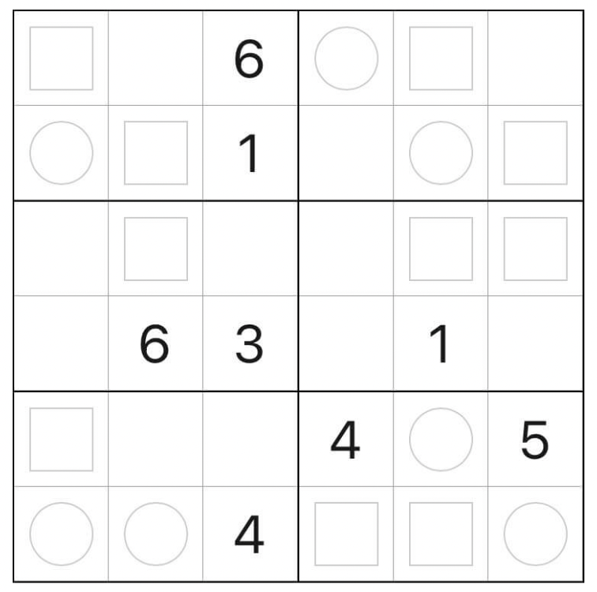

# 奇偶数独
<!-- START doctoc generated TOC please keep comment here to allow auto update -->
<!-- DON'T EDIT THIS SECTION, INSTEAD RE-RUN doctoc TO UPDATE -->

<!-- END doctoc generated TOC please keep comment here to allow auto update -->

> 参考 [9 宫奇偶数独](../../../9宫/额外区域类/绝对区域/额外宫类/同位数独.md)
>
## 题库

### 微信小程序

- 三思数独
