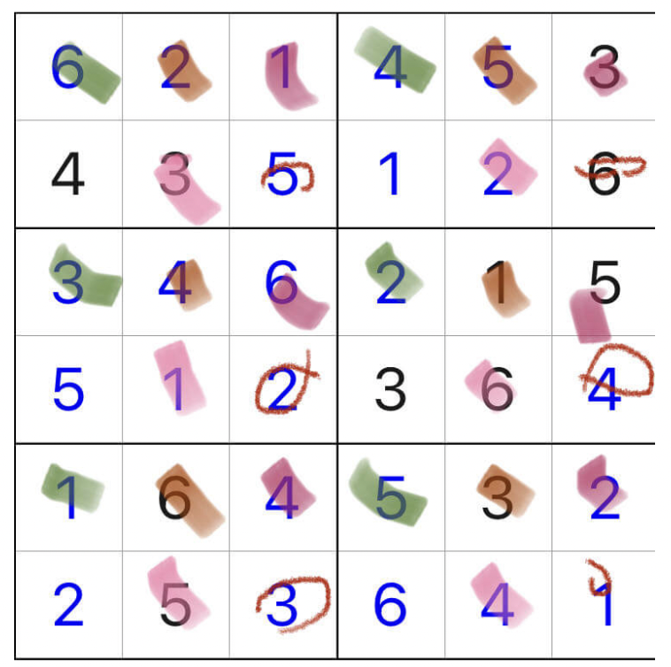

# 同位数独
<!-- START doctoc generated TOC please keep comment here to allow auto update -->
<!-- DON'T EDIT THIS SECTION, INSTEAD RE-RUN doctoc TO UPDATE -->
## 目录

- [题库](#%E9%A2%98%E5%BA%93)
  - [微信小程序](#%E5%BE%AE%E4%BF%A1%E5%B0%8F%E7%A8%8B%E5%BA%8F)

<!-- END doctoc generated TOC please keep comment here to allow auto update -->

> 参考 [9 宫同位数独](../../../9宫/额外区域类/绝对区域/额外宫类/同位数独.md)

## 题库

### 微信小程序

- 三思数独
