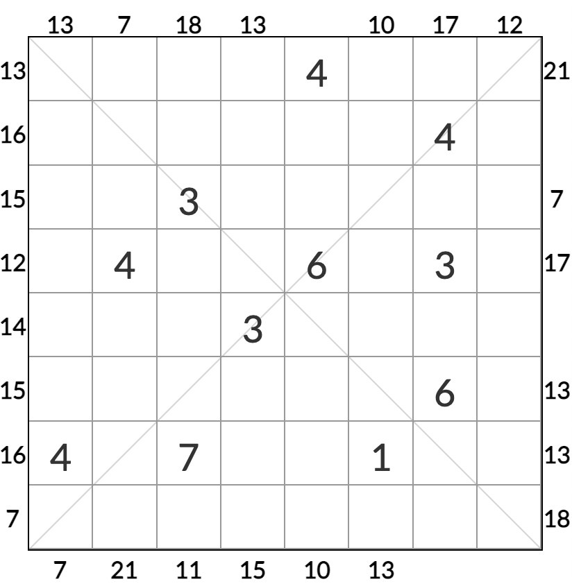

# 摩天和+花园+对角数独

## 目录

* [规则](摩天和+花园+对角数独.md#规则)
  * [标签](摩天和+花园+对角数独.md#标签)
* [题型名](摩天和+花园+对角数独.md#题型名)
* [题库](摩天和+花园+对角数独.md#题库)
  * [微信小程序](摩天和+花园+对角数独.md#微信小程序)

## 规则

|  序号 |   限制区域  | 限制规则                                                           |
| :-: | :-----: | -------------------------------------------------------------- |
|  1  |    行    | 0\~8填充                                                         |
|  2  |    列    | 0\~8填充                                                         |
|  3  |   对角线   | 0\~8填充                                                         |
|  4  | 提示数（盘外） | 提示数 `M`：该（观测位，向盘内方向）获得的[摩天和](../../../rules/rules.md#摩天和)为 `M` |

### 标签

* \#斜线/对角线
* \#比大小/摩天楼/摩天和

## 题型名

* 摩天楼和花园对角

## 题库

### 微信小程序

* 三思数独
