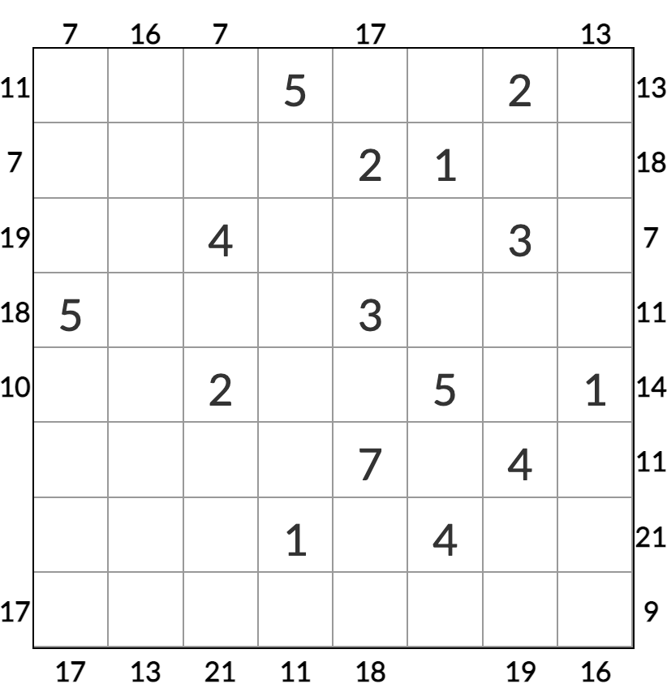

# 摩天和花园
<!-- START doctoc generated TOC please keep comment here to allow auto update -->
<!-- DON'T EDIT THIS SECTION, INSTEAD RE-RUN doctoc TO UPDATE -->
## 目录

- [规则](#%E8%A7%84%E5%88%99)
  - [标签](#%E6%A0%87%E7%AD%BE)
- [题型名](#%E9%A2%98%E5%9E%8B%E5%90%8D)
- [题库](#%E9%A2%98%E5%BA%93)
  - [微信小程序](#%E5%BE%AE%E4%BF%A1%E5%B0%8F%E7%A8%8B%E5%BA%8F)

<!-- END doctoc generated TOC please keep comment here to allow auto update -->

## 规则

| 序号  |  限制区域   | 限制规则                              |
|:---:|:-------:|:----------------------------------|
|  1  |    行    | 0~8填充                             |
|  2  |    列    | 0~8填充                             |
|  3  | 提示数（盘外） | 提示数 `M`：该（观测位，向盘内方向）获得的[摩天和]为 `M` |

### 标签

- #比大小/摩天楼/摩天和

## 题型名

- 摩天楼和花园

## 题库

### 微信小程序

- 三思数独

[摩天和]: ../../../rules/rules.md#摩天和
