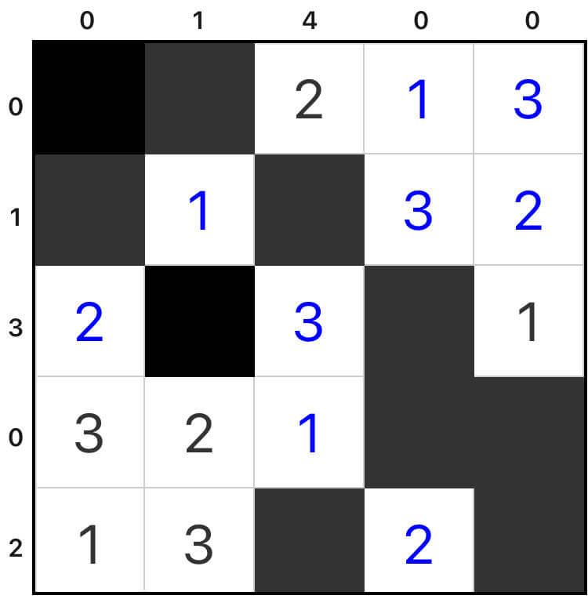

# 双黑格
<!-- START doctoc generated TOC please keep comment here to allow auto update -->
<!-- DON'T EDIT THIS SECTION, INSTEAD RE-RUN doctoc TO UPDATE -->
## 目录

- [规则](#%E8%A7%84%E5%88%99)
  - [标签](#%E6%A0%87%E7%AD%BE)
- [题型名](#%E9%A2%98%E5%9E%8B%E5%90%8D)
- [题库](#%E9%A2%98%E5%BA%93)
  - [微信小程序](#%E5%BE%AE%E4%BF%A1%E5%B0%8F%E7%A8%8B%E5%BA%8F)
- [扩展题型](#%E6%89%A9%E5%B1%95%E9%A2%98%E5%9E%8B)

<!-- END doctoc generated TOC please keep comment here to allow auto update -->

## 规则

| 序号  |  限制区域   | 限制规则                           |
|:---:|:-------:|:-------------------------------|
|  1  |    行    | 填充 `1~6` 和 2 个黑格               |
|  2  |    列    | 填充 `1~6` 和 2 个黑格               |
|  3  | 提示数（盘外） | 提示数`S`：当前位置向盘内看，黑格之间的所有数字和为`S` |

### 标签

- #计算/加法/连续位和/三明治

## 题型名

- 双黑格

## 题库

### 微信小程序

- 三思数独

## 扩展题型

- 三思数独
  - 5*5
  - 6*6
  - 7*7
  - 8*8
