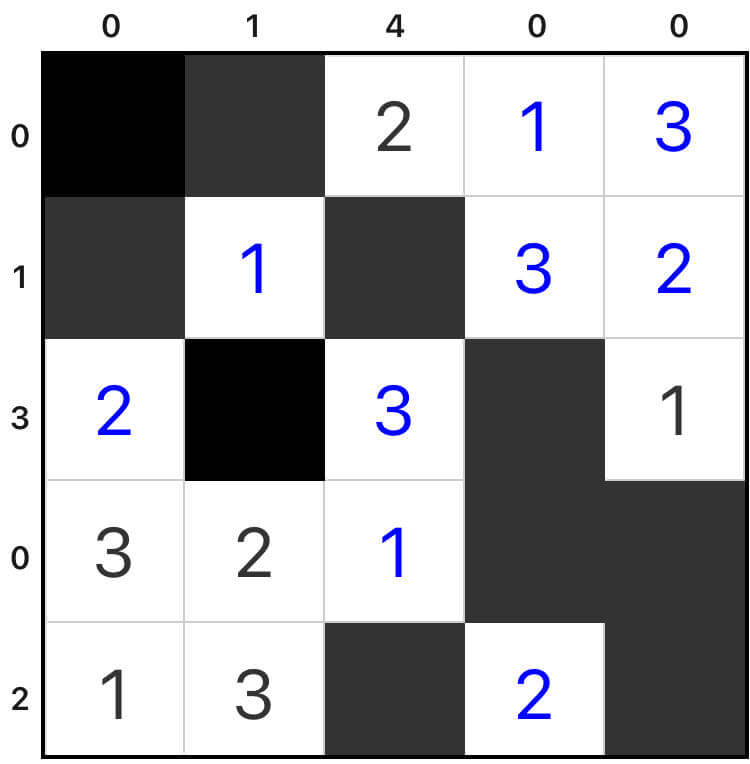

# 双黑格

## 目录

* [规则](双黑格.md#规则)
  * [标签](双黑格.md#标签)
* [题型名](双黑格.md#题型名)
* [题库](双黑格.md#题库)
  * [微信小程序](双黑格.md#微信小程序)
* [扩展题型](双黑格.md#扩展题型)

## 规则

|  序号 |   限制区域  | 限制规则                           |
| :-: | :-----: | ------------------------------ |
|  1  |    行    | 填充 `1~6` 和 2 个黑格               |
|  2  |    列    | 填充 `1~6` 和 2 个黑格               |
|  3  | 提示数（盘外） | 提示数`S`：当前位置向盘内看，黑格之间的所有数字和为`S` |

### 标签

* \#计算/加法/连续位和/三明治

## 题型名

* 双黑格

## 题库

### 微信小程序

* 三思数独

## 扩展题型

* 三思数独
  * 5\*5
  * 6\*6
  * 7\*7
  * 8\*8
