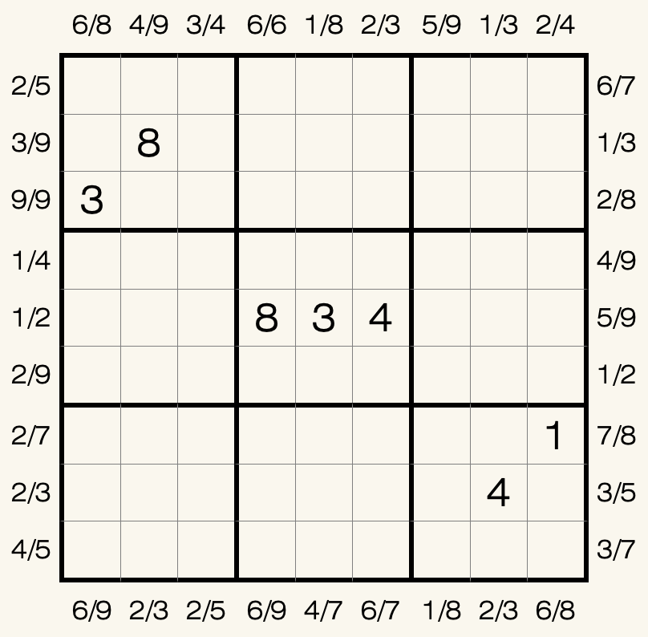

## 规则
| 序号 | 限制区域 | 限制规则 |
| :---: | :---: | :--- |
| 1 | 行 | [1~9填充] |
| 2 | 列 | [1~9填充] |
| 3 | 宫 | [1~9填充] |
| 4 | 提示数（盘外） | 提示数X/Y：当前位置向盘内看，以下描述至少有 1 个成立 - 第 X 个数是 Y  - 第 Y 个数是 X |

## 微信小程序
- [变形数独](#小程序://变形数独/高端数独/3QQ2xclTUJ6u2bc)

[1~9填充]: ../../../rules.md#1~9填充
