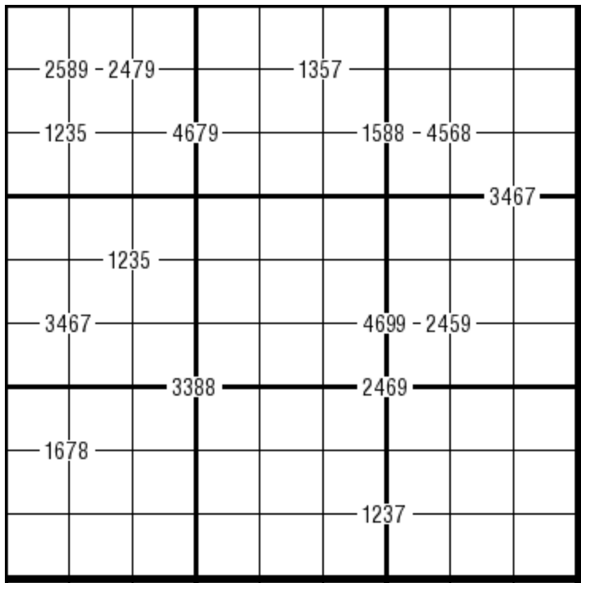

# 规则

| 序号  |  限制区域   | 限制规则                |
|:---:|:-------:|:--------------------|
|  1  |    行    | [1~9填充]             |
|  2  |    列    | [1~9填充]             |
|  3  |    宫    | [1~9填充]             |
|  4  | 提示数（顶点） | 提示数`ABCD`：周围 4 格的数字 |

## 标签

- [[格限数]]

# 别名

- 候选内提示数独
- 四重数独
- Quadruple Sudoku

# 题库

## 在线题库

- [独·数之道](http://www.sudokufans.org.cn/lx/game.index.php?type=ts) 【需要登录】
- [今日数独]【选题不便】

[1~9填充]: ../../../rules.md#1to9填充

[今日数独]: https://cn.sudoku.today/g-quadruple-sudoku/
