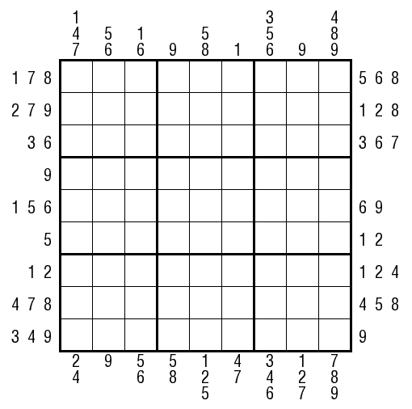

## 规则
| 序号 | 限制区域 | 限制规则 |
| :---: | :---: | :--- |
| 1 | 行 | [1~9填充] |
| 2 | 列 | [1~9填充] |
| 3 | 宫 | [1~9填充] |
| 4 | 提示数（盘外） | 提示数A[BC]：当前位置向盘内看，前 6 格一定出现的数字 - 如果提示数是奇数，则这个数出现在奇数位上 - 如果提示数是偶数，则这个数出现在偶数位上 |

## 题库
- [独·数之道](http://www.sudokufans.org.cn/lx/game.index.php?type=ts5) 【需要登录】

[1~9填充]: ../../../rules.md#1~9填充
