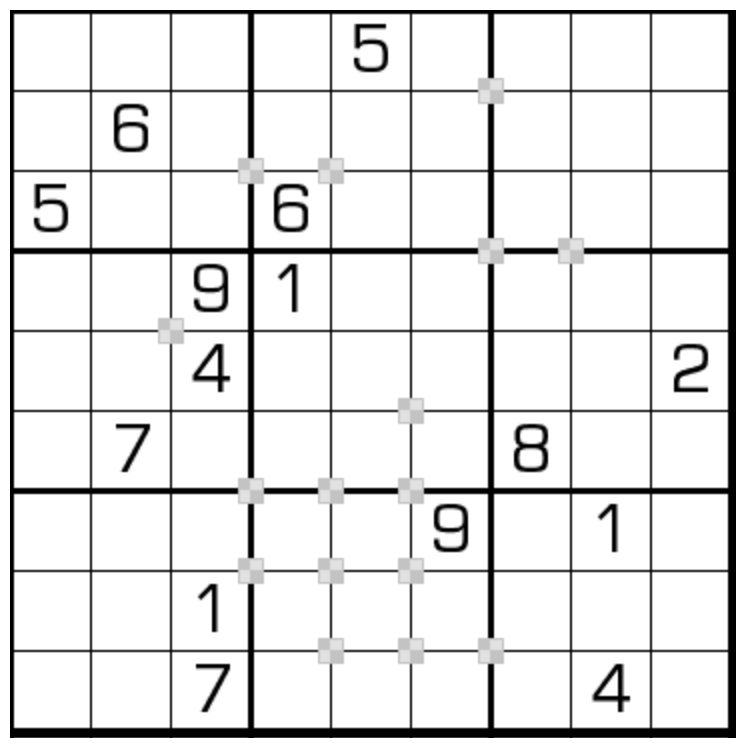

# 规则

| 序号  | 限制区域 | 限制规则                                                    | 备注  |
|:---:|:----:|:--------------------------------------------------------|:---:|
|  1  |  行   | [1~9填充]                                                 |     |
|  2  |  列   | [1~9填充]                                                 |     |
|  3  |  宫   | [1~9填充]                                                 |     |
|  4  | 标记点  | 标记点为`双色蛋糕` 中心，周围 4 格为蛋糕 蛋糕包含 2 个奇数和 2 个偶数，对角格的奇偶性相同 | 全标  |

## 标签

- [[格限数]]
- [[奇偶]]

# 别名

- 双色蛋糕数独
- Battenburg Sudoku

# 题库

## 在线题库

- [独·数之道](http://www.sudokufans.org.cn/lx/game.index.php?type=bb) 【需要登录】
- [今日数独]【选题不便】

[1~9填充]: ../../../../rules.md#1to9填充

[今日数独]: https://cn.sudoku.today/g-battenburg-sudoku/
