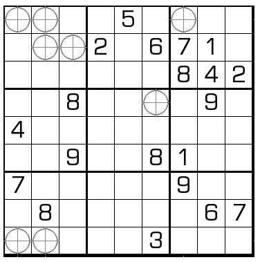

# 奇偶星数独
<!-- START doctoc generated TOC please keep comment here to allow auto update -->
<!-- DON'T EDIT THIS SECTION, INSTEAD RE-RUN doctoc TO UPDATE -->
## 目录

- [规则](#%E8%A7%84%E5%88%99)
  - [标签](#%E6%A0%87%E7%AD%BE)
- [题型名](#%E9%A2%98%E5%9E%8B%E5%90%8D)
- [题库](#%E9%A2%98%E5%BA%93)
  - [在线题库](#%E5%9C%A8%E7%BA%BF%E9%A2%98%E5%BA%93)
- [特色题型](#%E7%89%B9%E8%89%B2%E9%A2%98%E5%9E%8B)

<!-- END doctoc generated TOC please keep comment here to allow auto update -->

## 规则

| 序号  | 限制区域 | 限制规则         | 备注  |
|:---:|:----:|:-------------|:---:|
|  1  |  行   | [1~9填充]      |     |
|  2  |  列   | [1~9填充]      |     |
|  3  |  宫   | [1~9填充]      |     |
|  4  | 标记格  | 标记格为[奇偶星]的中心 | 全标  |

### 标签

- [[格限数]]
- [[奇偶]]

## 题型名

- 奇偶星数独

## 题库

### 在线题库

- [独·数之道](http://www.sudokufans.org.cn/lx/game.index.php?type=mine2) 【需要登录】

## 特色题型

- [十字花数独](十字花数独.md)

[1~9填充]: ../../../../rules.md#1to9填充
[奇偶星]: ../../../../rules.md#奇偶星
