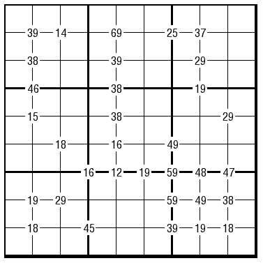

# 规则
| 序号 | 限制区域 | 限制规则 | 备注 |
| :---: | :---: | :--- | :---: |
| 1 | 行 | [1~9填充] | |
| 2 | 列 | [1~9填充] | |
| 3 | 宫 | [1~9填充] | |
| 4 | 提示数（顶点） | 标记点周围 4 格包含 2 个奇数和 2 个偶数 提示数`AB`：分别为 4 格中的最小数`A`和最大数`B` | 全标 |

# 题库

## 在线题库
- [独·数之道](http://www.sudokufans.org.cn/lx/game.index.php?type=clk3) 【需要登录】

[1~9填充]: ../../../../rules.md#1~9填充