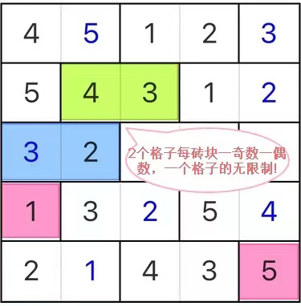

# 砖墙
<!-- START doctoc generated TOC please keep comment here to allow auto update -->
<!-- DON'T EDIT THIS SECTION, INSTEAD RE-RUN doctoc TO UPDATE -->
## 目录

- [规则](#%E8%A7%84%E5%88%99)
  - [标签](#%E6%A0%87%E7%AD%BE)
- [题型名](#%E9%A2%98%E5%9E%8B%E5%90%8D)
- [题库](#%E9%A2%98%E5%BA%93)
  - [微信小程序](#%E5%BE%AE%E4%BF%A1%E5%B0%8F%E7%A8%8B%E5%BA%8F)
- [扩展题型](#%E6%89%A9%E5%B1%95%E9%A2%98%E5%9E%8B)

<!-- END doctoc generated TOC please keep comment here to allow auto update -->

## 规则

| 序号  | 限制区域 | 限制规则                        |
|:---:|:----:|:----------------------------|
|  1  |  行   | [1~9填充]                     |
|  2  |  列   | [1~9填充]                     |
|  3  | 标记区域 | 标记区域为`砖块`：最多包含 1 个奇数和 1 个偶数 |

### 标签

- #格限数
- #计算/奇偶

## 题型名

- 砖墙

## 题库

### 微信小程序

- 三思数独

## 扩展题型

- [奇偶胶囊数独](奇偶胶囊数独.md)

[1~9填充]: ../../../../rules/rules.md#1to9填充
