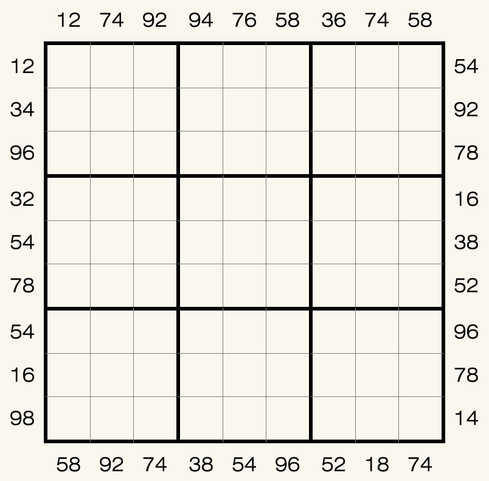

# 规则
| 序号  |  限制区域   | 限制规则                                   |
|:---:|:-------:|:---------------------------------------|
|  1  |    行    | [1~9填充]                                |
|  2  |    列    | [1~9填充]                                |
|  3  |    宫    | [1~9填充]                                |
|  4  | 提示数（盘外） | 提示数`AB`：分别为当前位置向盘内看到的第一个奇数`A`和第一个偶数`B` |

## 标签

- [[数限格]]
- [[奇偶]]

# 题型名

- 第一奇偶

# 题库

## 在线题库
- [独·数之道](http://www.sudokufans.org.cn/lx/game.index.php?type=oe) 【需要登录】

## 微信小程序
- ~~变形数独~~

[1~9填充]: ../../../../rules.md#1to9填充