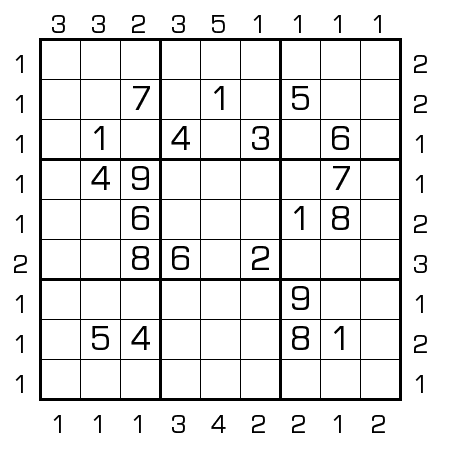

# 连续同奇偶性
<!-- START doctoc generated TOC please keep comment here to allow auto update -->
<!-- DON'T EDIT THIS SECTION, INSTEAD RE-RUN doctoc TO UPDATE -->

<!-- END doctoc generated TOC please keep comment here to allow auto update -->

## 规则

| 序号  |  限制区域   | 限制规则                                     |
|:---:|:-------:|:-----------------------------------------|
|  1  |    行    | [1~9填充]                                  |
|  2  |    列    | [1~9填充]                                  |
|  3  |    宫    | [1~9填充]                                  |
|  4  | 提示数（盘外） | 提示数 `C`：当前位置向盘内看，前 C 格奇偶性相同，第 C+1 格奇偶性不同 |

### 标签

- #格限数
- #计算/奇偶

## 题型名

- 连续同奇偶性
- Outside Parity Sudoku

## 题库

### 在线题库

- [独·数之道](http://www.sudokufans.org.cn/lx/game.index.php?type=mm4) 【需要登录】

[1~9填充]: ../../../../rules/rules.md#1to9填充
