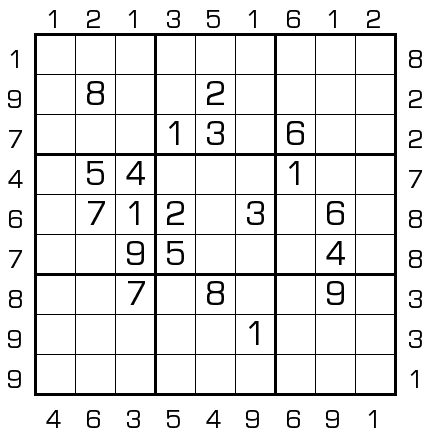

# 规则
| 序号 | 限制区域 | 限制规则 |
| :---: | :---: | :--- |
| 1 | 行 | [1~9填充] |
| 2 | 列 | [1~9填充] |
| 3 | 宫 | [1~9填充] |
| 4 | 提示数（盘外） | 提示数 `M`：当前位置向盘内看，第 1 格为 `N` ，第 N 格为 `M` |

# 题库

## 在线题库
- [独·数之道](http://www.sudokufans.org.cn/lx/game.index.php?type=mm3) 【需要登录】

[1~9填充]: ../../../rules.md#1~9填充
