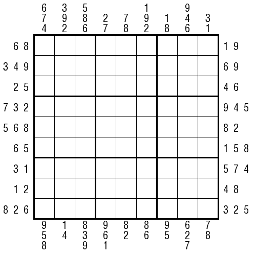

# 规则
| 序号  |  限制区域   | 限制规则                                               | 备注  |
|:---:|:-------:|:---------------------------------------------------|:----|
|  1  |    行    | [1~9填充]                                            |     |
|  2  |    列    | [1~9填充]                                            |     |
|  3  |    宫    | [1~9填充]                                            |     |
|  4  | 提示数（盘外） | 提示数`A[BC]`：当前位置向盘内看，前 6 格一定出现的数字 数字出现的顺序与提示数相同 | 半标  |

## 标签

- [[数限格]]

## 题型名
- 春天数独

# 题库

## 在线题库
- [独·数之道](http://www.sudokufans.org.cn/lx/game.index.php?type=ts2) 【需要登录】

[1~9填充]: ../../../rules.md#1to9填充
