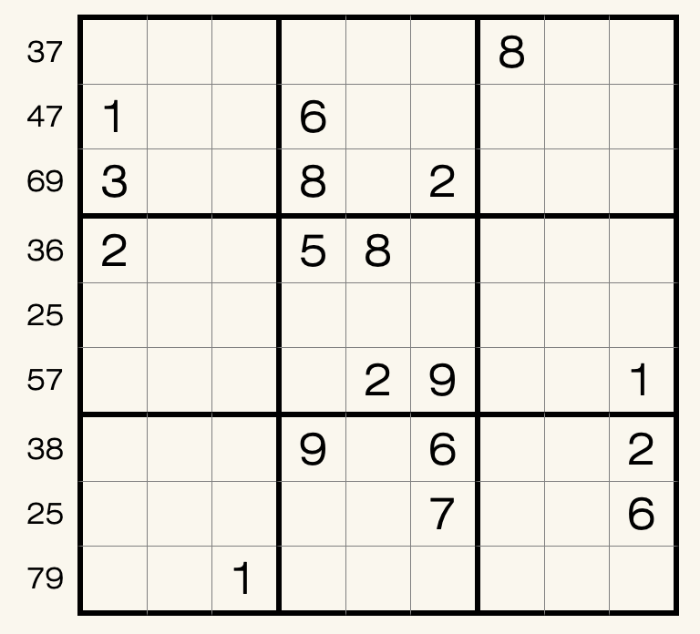

# 规则
| 序号 | 限制区域 | 限制规则 |
| :---: | :---: | :--- |
| 1 | 行 | [1~9填充] |
| 2 | 列 | [1~9填充] |
| 3 | 宫 | [1~9填充] |
| 4 | 提示数（盘外） | 提示数`AB`：本行内，`A` 和 `B` 所在格关于 5 列左右对称 |

# 题库

## 在线题库
- [独·数之道](http://www.sudokufans.org.cn/lx/game.index.php?type=cc) 【需要登录】

## 微信小程序
- 变形数独

[1~9填充]: ../../../rules.md#1to9填充
