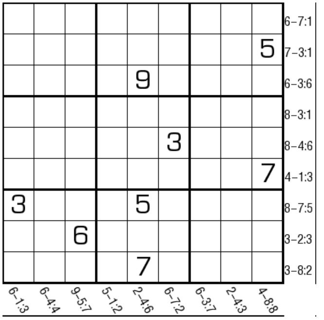

# 规则

| 序号  |  限制区域   | 限制规则                         |
|:---:|:-------:|:-----------------------------|
|  1  |    行    | [1~9填充]                      |
|  2  |    列    | [1~9填充]                      |
|  3  |    宫    | [1~9填充]                      |
|  4  | 提示数（盘右） | 提示数`A-D:B`：数字`A`向左 D 格为数字`B` |
|  5  | 提示数（盘下） | 提示数`A-D:B`：数字`A`向上 D 格为数字`B` |

## 标签

- [[数限格]]

# 题型名

- 补丁数独

# 题库

## 在线题库

- [独·数之道](http://www.sudokufans.org.cn/lx/game.index.php?type=jl) 【需要登录】

## 微信小程序

- ~~变形数独~~

[1~9填充]: ../../../rules.md#1to9填充