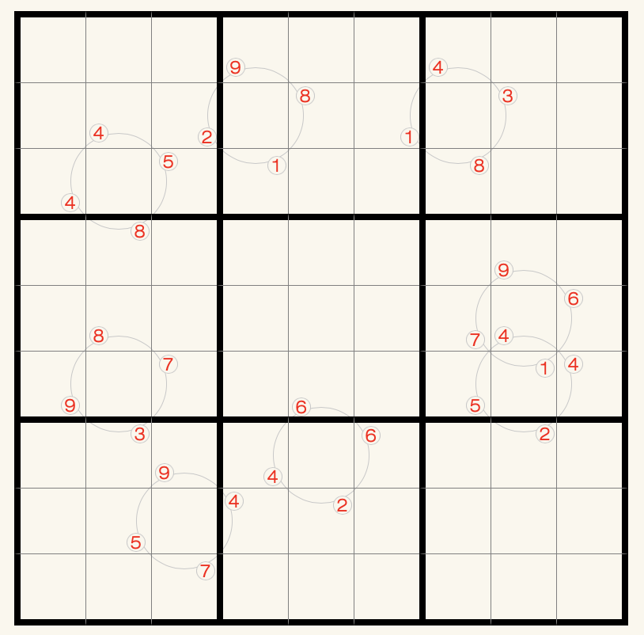

# 转轮数独
<!-- START doctoc generated TOC please keep comment here to allow auto update -->
<!-- DON'T EDIT THIS SECTION, INSTEAD RE-RUN doctoc TO UPDATE -->
## 目录

- [规则](#%E8%A7%84%E5%88%99)
  - [标签](#%E6%A0%87%E7%AD%BE)
- [题型名](#%E9%A2%98%E5%9E%8B%E5%90%8D)
  - [微信小程序](#%E5%BE%AE%E4%BF%A1%E5%B0%8F%E7%A8%8B%E5%BA%8F)

<!-- END doctoc generated TOC please keep comment here to allow auto update -->

## 规则

| 序号  | 限制区域 | 限制规则                                           |
|:---:|:----:|:-----------------------------------------------|
|  1  |  行   | [1~9填充]                                        |
|  2  |  列   | [1~9填充]                                        |
|  3  |  宫   | [1~9填充]                                        |
|  4  | 标记区域 | 标记区域为`转轮`，包含 4 格 4 格填入的数字为转轮提示数的旋转结果（不能翻转） |

### 标签

- [[格限数]]

## 题型名

- 轮转数独
- 轮盘数独

### 微信小程序

- ~~变形数独~~

[1~9填充]: ../../../rules.md#1to9填充
