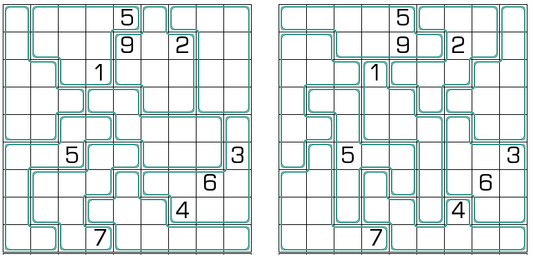

# 双胞锯齿数独
<!-- START doctoc generated TOC please keep comment here to allow auto update -->
<!-- DON'T EDIT THIS SECTION, INSTEAD RE-RUN doctoc TO UPDATE -->
## 目录

- [规则](#%E8%A7%84%E5%88%99)
- [题型名](#%E9%A2%98%E5%9E%8B%E5%90%8D)
- [题库](#%E9%A2%98%E5%BA%93)
  - [在线题库](#%E5%9C%A8%E7%BA%BF%E9%A2%98%E5%BA%93)

<!-- END doctoc generated TOC please keep comment here to allow auto update -->

## 规则

| 序号  | 限制区域 | 限制规则          | 备注      |
|:---:|:----:|:--------------|:--------|
|  1  |  行   | [1~9填充]       |         |
|  2  |  列   | [1~9填充]       |         |
|  3  | 异形宫  | [1~9填充]       | 18 个异形宫 |
|  4  |  全盘  | 两个盘面填入的数字完全相同 | &nbsp;  |

## 题型名

- 双胞锯齿数独
- 双锯数独

## 题库

### 在线题库

- [独·数之道](http://www.sudokufans.org.cn/lx/game.index.php?type=j2) 【需要登录】

[1~9填充]: ../../../rules.md#1to9填充
