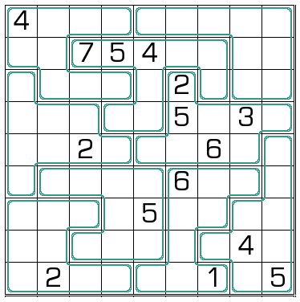

# 规则
| 序号 | 限制区域 | 限制规则 | 备注 |
| :---: | :---: | :--- | :--- |
| 1 | 行 | [1~9填充] | |
| 2 | 列 | [1~9填充] | |
| 3 | 异形宫 | [1~9填充] | |
| 4 | 全盘 | 同一异形宫且同一列内，不能违反以下条件 - `双气球数` 在`气球数` 上方 - `气球数` 在`非气球数` 上方 | - 双气球数：`8`  - 气球数：`469`  - 非气球数：`12357` |

# 题库

## 在线题库
- [独·数之道](http://www.sudokufans.org.cn/lx/game.index.php?type=jchqq) 【需要登录】

[1~9填充]: ../../../rules.md#1~9填充
