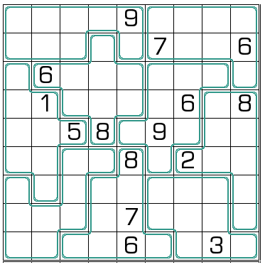

## 规则
| 序号 | 限制区域 | 限制规则 |
| :---: | :---: | :--- |
| 1 | 行 | [1~9填充] |
| 2 | 列 | [1~9填充] |
| 3 | 异形宫 | [1~9填充] |
| 4 | 边 | 异形宫边界两侧的[共边邻格]，包含一个奇数和一个偶数 |

## 题库
- [独·数之道](http://www.sudokufans.org.cn/lx/game.index.php?type=xq) 【需要登录】

[1~9填充]: ../../../rules.md#1~9填充
[共边邻格]: ../../../rules.md#共边邻格
