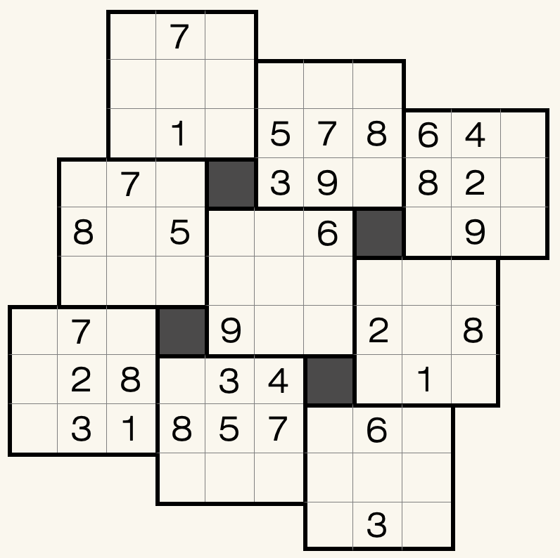

# 规则
| 序号  | 限制区域 | 限制规则      |
|:---:|:----:|:----------|
|  1  |  行   | [1~9不重复] |
|  2  |  列   | [1~9不重复] |
|  3  |  宫   | [1~9填充]  |
|  4  | 标记格  | 无需填写      |

# 题库

## 在线题库
- [独·数之道](http://www.sudokufans.org.cn/lx/game.index.php?type=yw2) 【需要登录】

## 微信小程序
- ~~变形数独~~

[1~9不重复]: ../../../rules.md#1to9不重复
[1~9填充]: ../../../rules.md#1to9填充
