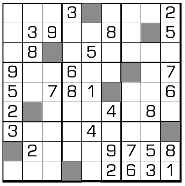

# 规则
| 序号 | 限制区域 | 限制规则 |
| :---: | :---: | :--- |
| 1 | 行 | [1~9不重复] |
| 2 | 列 | [1~9不重复] |
| 3 | 宫 | [1~9不重复] |
| 4 | 标记格 | 无需填写 |

# 别名
- Blackout Sudoku

# 题库

## 在线题库
- [独·数之道](http://www.sudokufans.org.cn/lx/game.index.php?type=qym) 【需要登录】

# 技巧
- 唯余
- 数对
- 区块删候选
- 致命

> 引用
> - Bilibili：[11：缺一门数独](https://www.bilibili.com/read/cv10180719)

[1~9不重复]: ../../../rules.md#1~9不重复
