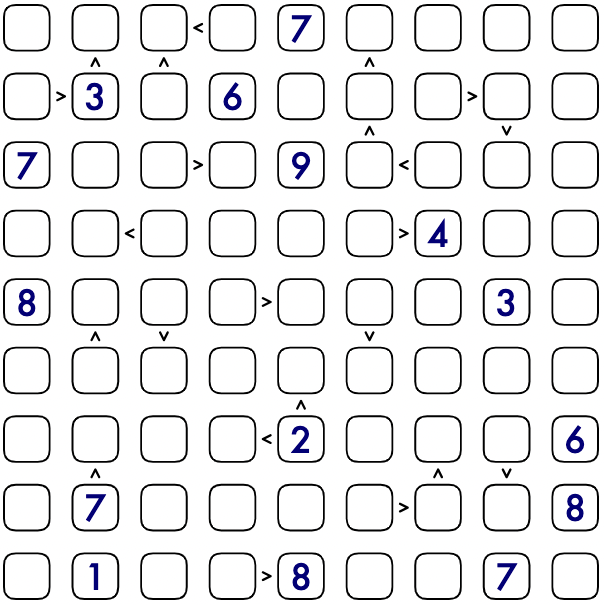

# Futoshiki
<!-- START doctoc generated TOC please keep comment here to allow auto update -->
<!-- DON'T EDIT THIS SECTION, INSTEAD RE-RUN doctoc TO UPDATE -->
## 目录

- [规则](#%E8%A7%84%E5%88%99)
  - [标签](#%E6%A0%87%E7%AD%BE)
- [题库](#%E9%A2%98%E5%BA%93)
  - [在线题库](#%E5%9C%A8%E7%BA%BF%E9%A2%98%E5%BA%93)
- [扩展题型](#%E6%89%A9%E5%B1%95%E9%A2%98%E5%9E%8B)

<!-- END doctoc generated TOC please keep comment here to allow auto update -->

## 规则

| 序号  | 限制区域 | 限制规则                     |
|:---:|:----:|:-------------------------|
|  1  |  行   | [1~9填充]                  |
|  2  |  列   | [1~9填充]                  |
|  3  | 标记边  | 标记边两侧的[共边邻格]满足 `>` 的大小关系 |

### 标签

- [[比大小]]

## 题库

### 在线题库

- [不等式](https://cn.puzzle-futoshiki.com/futoshiki-9x9-hard/)
- [KrazyDad](https://krazydad.com/play/futoshiki/?kind=9x9)
- [Simon Tatham's Portable Puzzle Collection](https://www.chiark.greenend.org.uk/~sgtatham/puzzles/js/unequal.html)

## 扩展题型

- [数比数独](数比数独.md)

[1~9填充]: ../../../rules.md#1to9填充

[共边邻格]: ../../../rules.md#共边邻格
