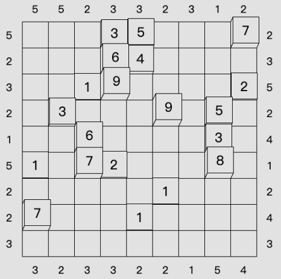

# Towers
<!-- START doctoc generated TOC please keep comment here to allow auto update -->
<!-- DON'T EDIT THIS SECTION, INSTEAD RE-RUN doctoc TO UPDATE -->
## 目录

- [规则](#%E8%A7%84%E5%88%99)
  - [标签](#%E6%A0%87%E7%AD%BE)
- [题型名](#%E9%A2%98%E5%9E%8B%E5%90%8D)
- [题库](#%E9%A2%98%E5%BA%93)
  - [在线题库](#%E5%9C%A8%E7%BA%BF%E9%A2%98%E5%BA%93)
- [技巧](#%E6%8A%80%E5%B7%A7)
- [扩展题型](#%E6%89%A9%E5%B1%95%E9%A2%98%E5%9E%8B)

<!-- END doctoc generated TOC please keep comment here to allow auto update -->

## 规则

| 序号  |  限制区域   | 限制规则                                 |
|:---:|:-------:|:-------------------------------------|
|  1  |    行    | [1~9填充]                              |
|  2  |    列    | [1~9填充]                              |
|  3  | 提示数（盘外） | 提示数 `M`：该（观测位，向盘内方向）获得的[摩天楼观测数]为 `M` |

### 标签

- #比大小/摩天楼

## 题型名

- Towers

## 题库

### 在线题库

- [Simon Tatham's Portable Puzzle Collection](https://www.chiark.greenend.org.uk/~sgtatham/puzzles/js/towers.html)

## 技巧

- [唯一数值确定](https://www.bilibili.com/read/cv10181180)
  - 提示`1`
  - 提示`2`
- [对端外提示和`10`定式](https://www.bilibili.com/read/cv10181180)
  - 确定`1`
  - 确定`9`
- [唯一序列](https://www.bilibili.com/read/cv10181180)

## 扩展题型

- [摩天楼数独.md](摩天楼数独.md)

[1~9填充]: ../../../rules/rules.md#1to9填充
[摩天楼观测数]: ../../../rules/rules.md#摩天楼观测数
