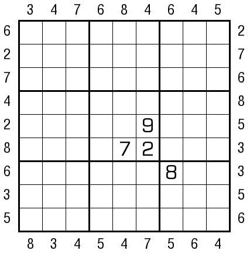

# 中位数数独
<!-- START doctoc generated TOC please keep comment here to allow auto update -->
<!-- DON'T EDIT THIS SECTION, INSTEAD RE-RUN doctoc TO UPDATE -->

<!-- END doctoc generated TOC please keep comment here to allow auto update -->

## 规则

| 序号  |  限制区域   | 限制规则                           |
|:---:|:-------:|:-------------------------------|
|  1  |    行    | [1~9填充]                        |
|  2  |    列    | [1~9填充]                        |
|  3  |    宫    | [1~9填充]                        |
|  4  | 提示数（盘外） | 提示数 `M`：当前位置向盘内看，前 3 格的中位数 `M` |

### 标签

- #比大小/中位数

## 题型名

- 中位数数独
- Median Sudoku

## 题库

### 在线题库

- [独·数之道](http://www.sudokufans.org.cn/main.index.php?type=px2) 【需要登录】

### 微信小程序

- ~~变形数独~~

[1~9填充]: ../../../rules/rules.md#1to9填充
