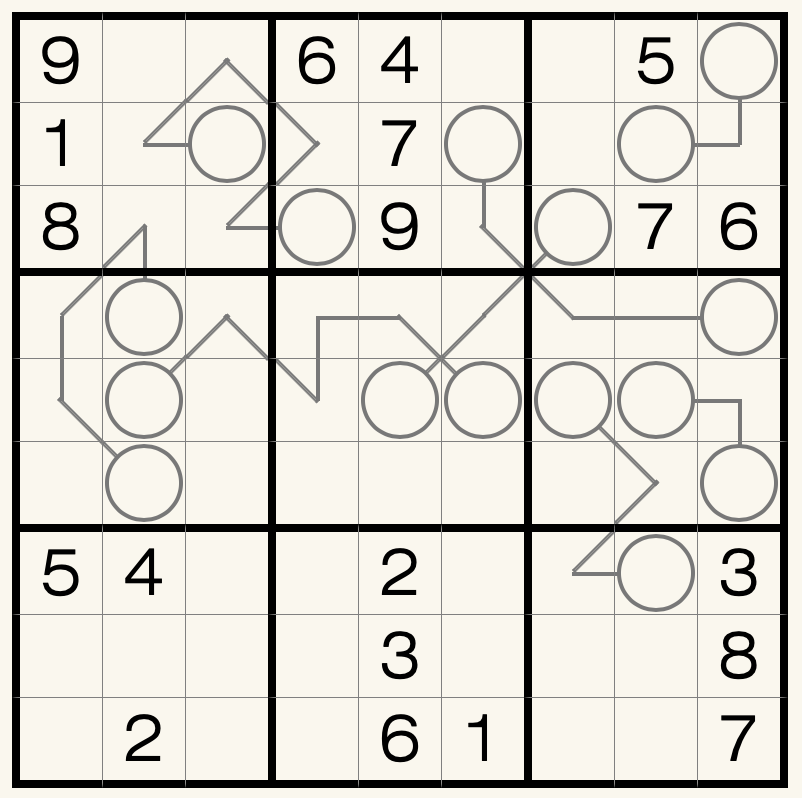

# 之间数独

## 规则

| 序号  | 限制区域 | 限制规则                        |
|:---:|:----:|:----------------------------|
|  1  |  行   | [1~9填充]                     |
|  2  |  列   | [1~9填充]                     |
|  3  |  宫   | [1~9填充]                     |
|  4  | 标记区域 | `标记线上的数字` 大小处于两端`标记圈的数字` 之间 |

### 标签

- [[比大小]]
- [[区间]]

### 微信小程序

- ~~变形数独~~

[1~9填充]: ../../../rules.md#1to9填充
