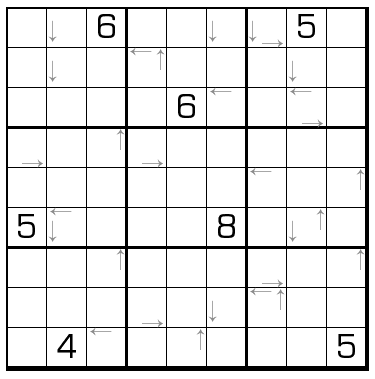

# 规则
| 序号  | 限制区域 | 限制规则                          |
|:---:|:----:|:------------------------------|
|  1  |  行   | [1~9填充]                      |
|  2  |  列   | [1~9填充]                      |
|  3  |  宫   | [1~9填充]                      |
|  4  | 标记格  | 标记格的数字为该（观测位，观测方向）获得的[摩天楼观测数] |

# 题库

## 在线题库
- [独·数之道](http://www.sudokufans.org.cn/lx/game.index.php?type=hmt) 【需要登录】

[1~9填充]: ../../../rules.md#1to9填充
[摩天楼观测数]: ../../../rules.md#摩天楼观测数
