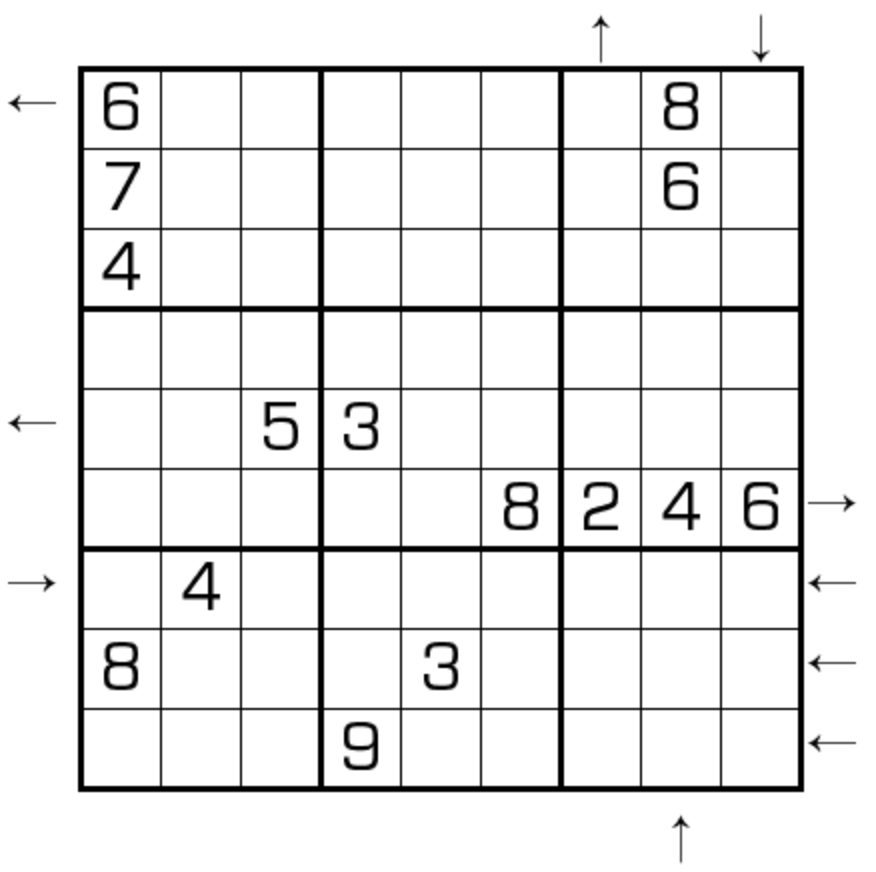

# 规则

| 序号  | 限制区域 | 限制规则                                                 | 备注  |
|:---:|:----:|:-----------------------------------------------------|:----|
|  1  |  行   | [1~9填充]                                              |     |
|  2  |  列   | [1~9填充]                                              |     |
|  3  |  宫   | [1~9填充]                                              |     |
|  4  | 标记符号 | 当前位置向盘内看，前 3 格的排序情况 - 已排序：箭头指向升序方向 - 未排序：无箭头 | 全标  |

## 标签
- [[比大小]]
- [[排序]]

# 别名

- 排序数独
- 升序降序数独
- Rossini Sudoku
- 方向数独

# 题库

## 在线题库

- [独·数之道](http://www.sudokufans.org.cn/lx/game.index.php?type=px) 【需要登录】
- [今日数独]【选题不便】

## 微信小程序

- ~~变形数独~~
- 三思数独

[1~9填充]: ../../../rules.md#1to9填充

[今日数独]: https://cn.sudoku.today/g-rossini-sudoku/
