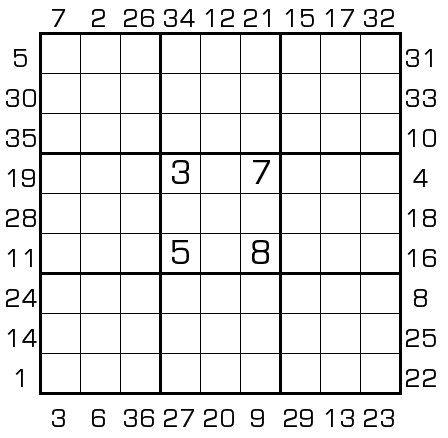

## 标签
- [[比大小]]
- [[排序]]

# 规则
| 序号 | 限制区域 | 限制规则 | 备注 |
| :---: | :---: | :--- | :--- |
| 1 | 行 | [1~9填充] | |
| 2 | 列 | [1~9填充] | |
| 3 | 宫 | [1~9填充] | |
| 4 | 提示数（盘外） | 从盘外 36 个点位向盘内看，可获得 36 个 9 位数，并从小到大排序。 提示数 `M`: 当前位观察到的 9 位数，排序是 M | 序号 1 的 9 位数最小 序号 36 的 9 位数最大 |

# 题库

## 在线题库
- [独·数之道](http://www.sudokufans.org.cn/lx/game.index.php?type=ps) 【需要登录】

[1~9填充]: ../../../rules.md#1to9填充