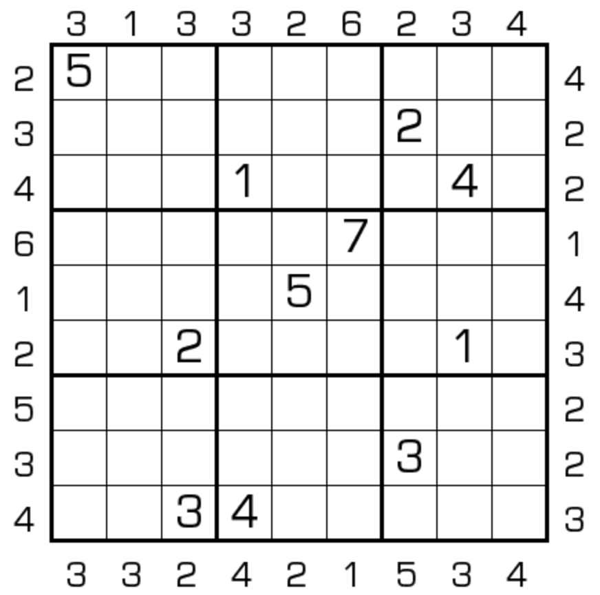

# 摩天楼数独
<!-- START doctoc generated TOC please keep comment here to allow auto update -->
<!-- DON'T EDIT THIS SECTION, INSTEAD RE-RUN doctoc TO UPDATE -->

<!-- END doctoc generated TOC please keep comment here to allow auto update -->

## 规则

| 序号  |  限制区域   | 限制规则                                 |
|:---:|:-------:|:-------------------------------------|
|  1  |    行    | [1~9填充]                              |
|  2  |    列    | [1~9填充]                              |
|  3  |    宫    | [1~9填充]                              |
|  4  | 提示数（盘外） | 提示数 `M`：该（观测位，向盘内方向）获得的[摩天楼观测数]为 `M` |

### 标签

- #比大小/摩天楼

## 题型名

- 摩天楼数独
- Skyscraper Sudoku
- 废墟

## 题库

### 在线题库

- [独·数之道](http://www.sudokufans.org.cn/lx/game.index.php?type=build) 【需要登录】
- [KrazyDad](https://krazydad.com/play/skysudoku/)
- [GridPuzzle](https://cn.gridpuzzle.com/skyscraper-sudoku/evil)
- [今日数独]【选题不便】

### 微信小程序

- 三思数独
- 鳄鱼数独

## 技巧

- [Towers 技巧](Towers.md#技巧)

## 扩展题型

- [摩天楼花园](摩天楼花园.md)
- [9选6+摩天和](../混合类/9选6+摩天和.md)
- [楼差楼数独](../混合类/楼差楼数独.md)
- [楼差锯数独](../混合类/楼差锯数独.md)
- [楼差数数独](../混合类/楼差数数独.md)
- [连遮楼数独](../混合类/连遮楼数独.md)
- [锯齿+摩天楼数独](../混合类/锯齿+摩天楼数独.md)

> 引用
>
> - Bilibili：[15：摩天楼数独](https://www.bilibili.com/read/cv10181180)

[1~9填充]: ../../../rules/rules.md#1to9填充

[摩天楼观测数]: ../../../rules/rules.md#摩天楼观测数

[今日数独]: https://cn.sudoku.today/g-skyscrapers-sudoku/
