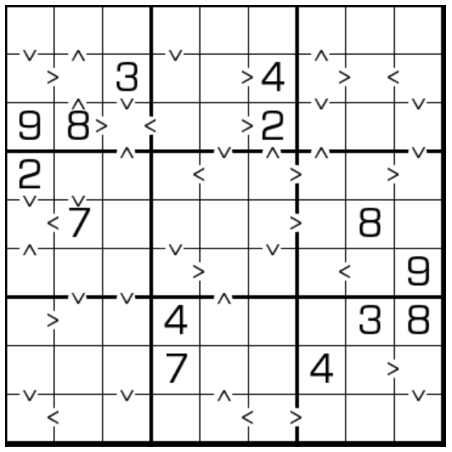

# 数比数独

## 规则

| 序号  | 限制区域 | 限制规则                     |
|:---:|:----:|:-------------------------|
|  1  |  行   | [1~9填充]                  |
|  2  |  列   | [1~9填充]                  |
|  3  |  宫   | [1~9填充]                  |
|  4  | 标记边  | 标记边两侧的[共边邻格]满足 `>` 的大小关系 |

### 标签

- [[比大小]]

## 题型名

- 数比数独
- Greater Than Sudoku
- Jigoku
- Unequal

## 题库

### 在线题库

- [Killer Sudoku Online] 【选题不便】
- 独·数之道【需要登录】
  - [宫内全标](http://www.sudokufans.org.cn/lx/game.index.php?type=gt9)
  - [半标](http://www.sudokufans.org.cn/lx/game.index.php?type=gt2)
- [KrazyDad](https://krazydad.com/play/jigoku/)
- [今日数独]【选题不便】

## App

- 数独高高手

### 微信小程序

- 口袋数独

## 特色题型

- [堡垒数独](堡垒数独.md)

## 扩展题型

- [前X数和+数比数独](../混合类/前X数和+数比数独.md)
- [黑白点+数比数独](../混合类/黑白点+数比数独.md)
- [数比+边框和数独](../混合类/数比+边框和数独.md)
- [数比+对角数独](../混合类/数比+对角数独.md)
- [数比+杀手数独](../混合类/数比+杀手数独.md)
- [数比+全标连续数独](../混合类/数比+全标连续数独.md)
- [数比+对角+杀手数独](../混合类/数比+对角+杀手数独.md)
- [差异数独](../混合类/差异数独.md)
- [楼差楼数独](../混合类/楼差楼数独.md)
- [楼差锯数独](../混合类/楼差锯数独.md)

[1~9填充]: ../../../rules.md#1to9填充

[共边邻格]: ../../../rules.md#共边邻格

[今日数独]: https://cn.sudoku.today/g-greater-than-sudoku/
