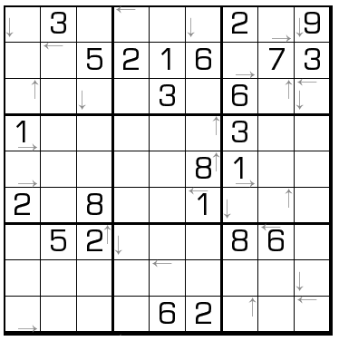

# 最大邻居

## 规则

| 序号  | 限制区域 | 限制规则                    |
|:---:|:----:|:------------------------|
|  1  |  行   | [1~9填充]                 |
|  2  |  列   | [1~9填充]                 |
|  3  |  宫   | [1~9填充]                 |
|  4  | 标记格  | 标记方向指向 标记格的[共边邻格]中最大的那格 |

### 标签

[[比大小]]

## 题库

### 在线题库

- [独·数之道](http://www.sudokufans.org.cn/lx/game.index.php?type=nbb) 【需要登录】

[1~9填充]: ../../../rules.md#1to9填充
[共边邻格]: ../../../rules.md#共边邻格
