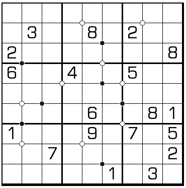

# 规则
| 序号 | 限制区域 | 限制规则 | 备注 |
| :---: | :---: | :--- | :--- |
| 1 | 行 | [1~9填充] | |
| 2 | 列 | [1~9填充] | |
| 3 | 宫 | [1~9填充] | |
| 4 | 标记点 | 标记点指示周围 4 格的排序情况 - 满足顺时针递增：黑点 - 满足逆时针递增：白点 - 其他：无标记 | 全标 |

# 题库

## 在线题库
- [独·数之道](http://www.sudokufans.org.cn/lx/game.index.php?type=clk) 【需要登录】

[1~9填充]: ../../../rules.md#1~9填充