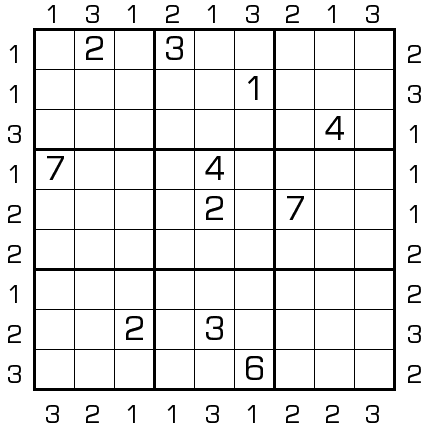

## 规则
| 序号 | 限制区域 | 限制规则 |
| :---: | :---: | :--- |
| 1 | 行 | [1~9填充] |
| 2 | 列 | [1~9填充] |
| 3 | 宫 | [1~9填充] |
| 4 | 提示数（盘外) | 提示数 `M`：当前位置向盘内看，前 3 格中最大的数字出现在第 M 格 |

## 题库
- [独·数之道](http://www.sudokufans.org.cn/lx/game.index.php?type=bk1) 【需要登录】

[1~9填充]: ../../../rules.md#1~9填充