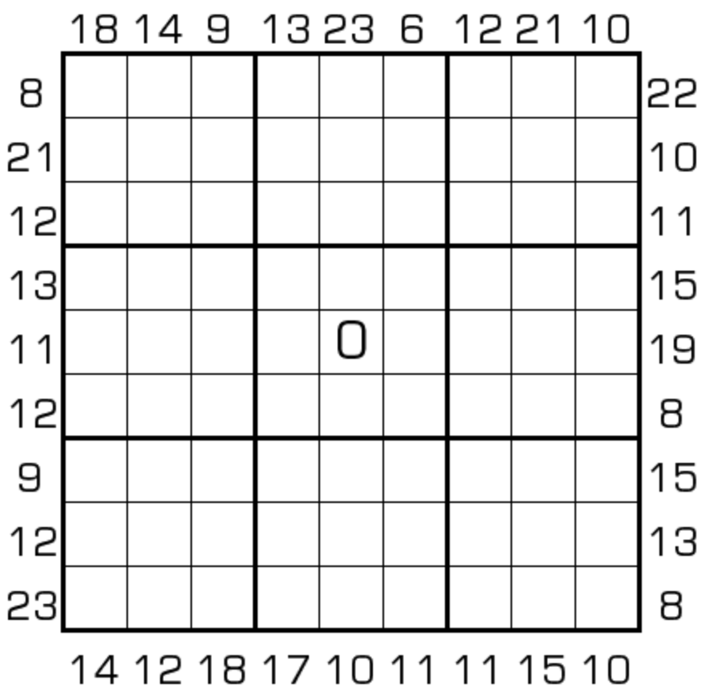

# 0-9边框和

## 规则

| 序号  |  限制区域   | 限制规则           |
|:---:|:-------:|:---------------|
|  1  |    行    | [0~9不重复]       |
|  2  |    列    | [0~9不重复]       |
|  3  |    宫    | [0~9不重复]       |
|  4  | 提示数（盘外） | 提示数 `S`: [边框和] |

## 题库

### 在线题库

- [独·数之道](http://www.sudokufans.org.cn/lx/game.index.php?type=bk09) 【需要登录】

[0~9不重复]: ../../../rules.md#0to9不重复

[边框和]: ../../../rules.md#边框和
