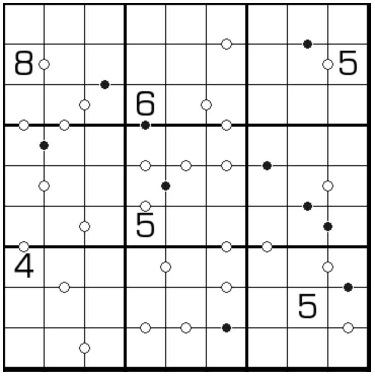

# 0-9黑白点

## 规则

| 序号  | 限制区域 | 限制规则                  | 备注  |
|:---:|:----:|:----------------------|:---:|
|  1  |  行   | [0~9不重复]             |     |
|  2  |  列   | [0~9不重复]             |     |
|  3  |  宫   | [0~9不重复]             |     |
|  4  | 标记边  | 标记边两侧的[共边邻格]满足[黑白点]约束 | 全标  |

## 题库

### 在线题库

- [独·数之道](http://www.sudokufans.org.cn/lx/game.index.php?type=hb09) 【需要登录】

[0~9不重复]: ../../../rules.md#0to9不重复
[共边邻格]: ../../../rules.md#共边邻格
[黑白点]: ../../../rules.md#黑白点
