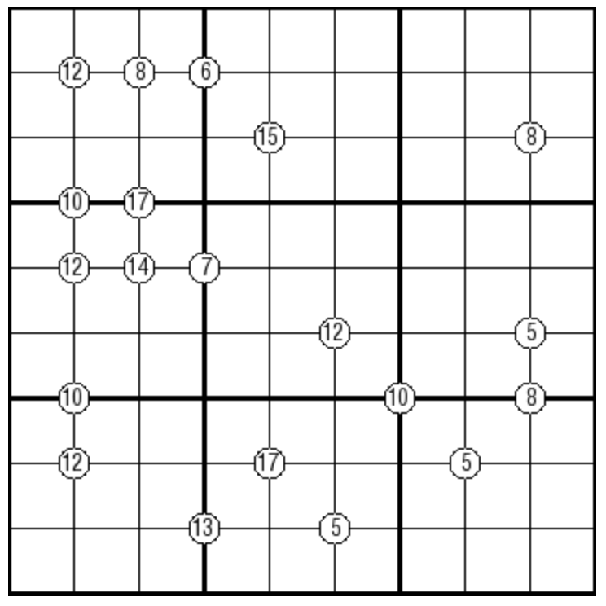

# 规则
| 序号 | 限制区域 | 限制规则 |
| :---: | :---: | :--- |
| 1 | 行 | [9选6填充] |
| 2 | 列 | [9选6填充] |
| 3 | 宫 | [9选6填充] |
| 4 | 全盘 | [全盘9选6填充] |
| 5 | 提示数（顶点） | 提示数 `S`：周围 4 格中仅 2 格有数，且 2 格数字和为 `S` |

# 题库

## 在线题库
- [独·数之道](http://www.sudokufans.org.cn/lx/game.index.php?type=9s6xxoo) 【需要登录】

[9选6填充]: ../../../rules.md#9选6填充
[全盘9选6填充]: ../../../rules.md#全盘9选6填充