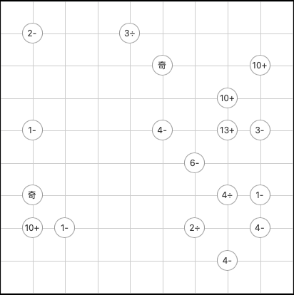

# 交叉算

<!-- START doctoc generated TOC please keep comment here to allow auto update -->
<!-- DON'T EDIT THIS SECTION, INSTEAD RE-RUN doctoc TO UPDATE -->
## 目录

- [规则](#%E8%A7%84%E5%88%99)
  - [标签](#%E6%A0%87%E7%AD%BE)
- [题库](#%E9%A2%98%E5%BA%93)
  - [微信小程序](#%E5%BE%AE%E4%BF%A1%E5%B0%8F%E7%A8%8B%E5%BA%8F)
- [扩展题型](#%E6%89%A9%E5%B1%95%E9%A2%98%E5%9E%8B)

<!-- END doctoc generated TOC please keep comment here to allow auto update -->

## 规则

<!-- markdownlint-disable MD013 -->

| 序号  | 限制区域  | 限制规则                                         | 备注         |
|:---:|:-----:|:---------------------------------------------|:-----------|
|  1  |   行   | [1~9填充]                                      |            |
|  2  |   列   | [1~9填充]                                      |            |
|  3  | 算数标记点 | 标记信息`R[+-*/]`：标记点为中心，对角格通过提示计算符号的计算结果都 = `R` | 半标         |
|  4  | 奇偶标记点 | 标记信息`奇/偶`：标记点为中心，周围 4 格奇偶性同标记信息              | 半标         |

<!-- markdownlint-enable MD013 -->

### 标签

- #计算/奇偶
- #计算/加法
- #计算/减法
- #计算/乘法
- #计算/除法

## 题库

### 微信小程序

- 三思数独

## 扩展题型

- 交叉算
  - 三思数独
    - 4*4
    - 5*5
    - 6*6
    - 7*7
    - 8*8
- 交叉算 Pro：无盘面提示数
  - 三思数独
    - 4*4
    - 5*5
    - 6*6
    - 7*7
    - 8*8
    - 9*9

[1~9填充]: ../../../rules/rules.md#1to9填充
