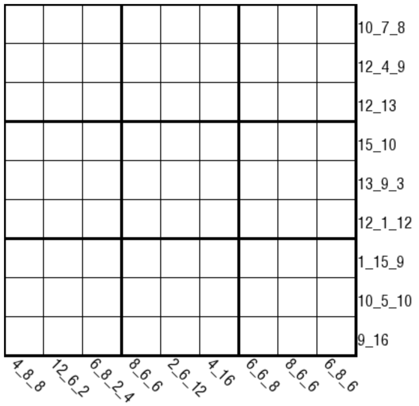

# 奇偶分段和

## 规则

<!-- markdownlint-disable MD013 -->
| 序号  |  限制区域   | 限制规则                                                 | 备注         |
|:---:|:-------:|:-----------------------------------------------------|:-----------|
|  1  |    行    | [1~9填充]                                              |            |
|  2  |    列    | [1~9填充]                                              |            |
|  3  |    宫    | [1~9填充]                                              |            |
|  4  | 提示数（盘右) | 以偶数为界，本行被分隔为多个奇数段 提示数 `A[_B_C_D_E]`：依次分别是每个奇数段的和 | 有 1-5 个奇数段 |
|  5  | 提示数（盘下) | 以奇数为界，本列被分隔为多个偶数段 提示数 `A[_B_C_D]`：依次分别是每个偶数段的和   | 有 1-4 个偶数段 |
<!-- markdownlint-enable MD013 -->

## 题库

### 在线题库

- [独·数之道](http://www.sudokufans.org.cn/lx/game.index.php?type=fdh2) 【需要登录】

[1~9填充]: ../../../rules.md#1to9填充
