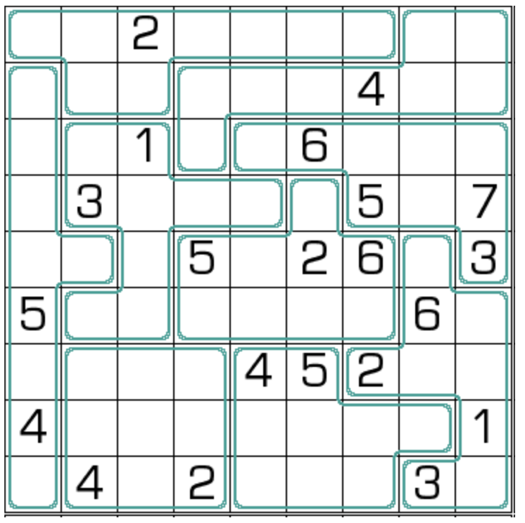

# 对8数独
<!-- START doctoc generated TOC please keep comment here to allow auto update -->
<!-- DON'T EDIT THIS SECTION, INSTEAD RE-RUN doctoc TO UPDATE -->

<!-- END doctoc generated TOC please keep comment here to allow auto update -->

## 规则

| 序号 | 限制区域 | 限制规则 | 备注 |
| :---: | :---: | :--- | :--- |
| 1 | 行 | 填入 `1-8`，使得`1-7`恰好出现 1 次，`8`出现 2 次 | |
| 2 | 列 | 填入 `1-8`，使得`1-7`恰好出现 1 次，`8`出现 2 次 | |
| 3 | 异形宫 | 填入 `1-8`，使得`1-7`恰好出现 1 次，`8`出现 2 次 | |
| 4 | 全盘 | `8`的[邻格]不能出现`8` | 即满足`8`的[无缘]约束 |

## 题库

### 在线题库

- [独·数之道](http://www.sudokufans.org.cn/lx/game.index.php?type=d8) 【需要登录】

[邻格]: ../../../rules/rules.md#邻格
[无缘]: ../../../rules/rules.md#无缘
