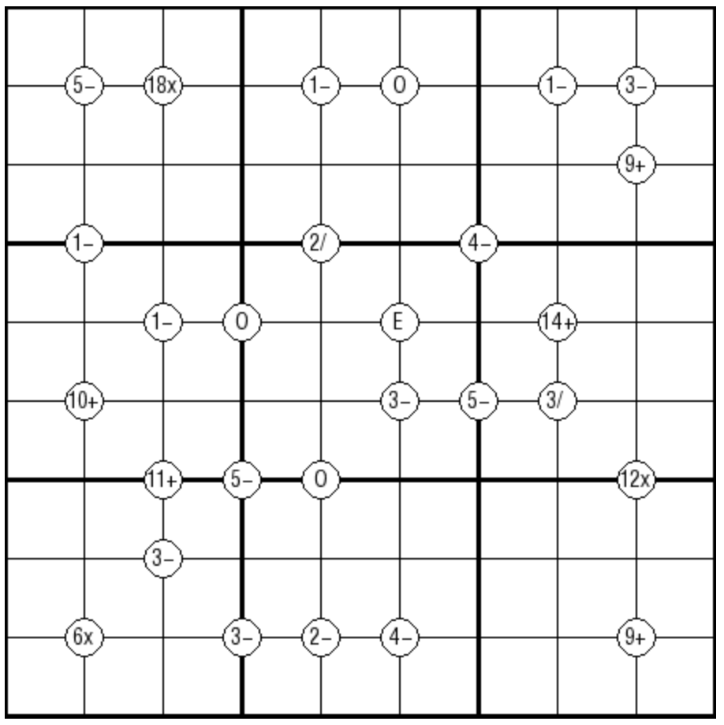

# 规则

| 序号  |  限制区域   | 限制规则                               | 备注  |
|:---:|:-------:|:-----------------------------------|:---:|
|  1  |    行    | [1~9填充]                            |     |
|  2  |    列    | [1~9填充]                            |     |
|  3  |    宫    | [1~9填充]                            |     |
|  4  | 提示数（顶点） | 提示数 `R[+-*/]`：对角两格数字经过指定运算后，结果均为 R | 全标  |
|  5  |  标记顶点   | `O`：周围 4 格都是奇数                     | 全标  |
|  6  |  标记顶点   | `E`：周围 4 格都是偶数                     | 全标  |

# 别名

- 数学数独
- 运算数独

# 题库

## 在线题库

- [独·数之道](http://www.sudokufans.org.cn/lx/game.index.php?type=math) 【需要登录】
- [今日数独]【选题不便】

[1~9填充]: ../../../rules.md#1~9填充

[今日数独]: https://cn.sudoku.today/g-mathrax-sudoku/
