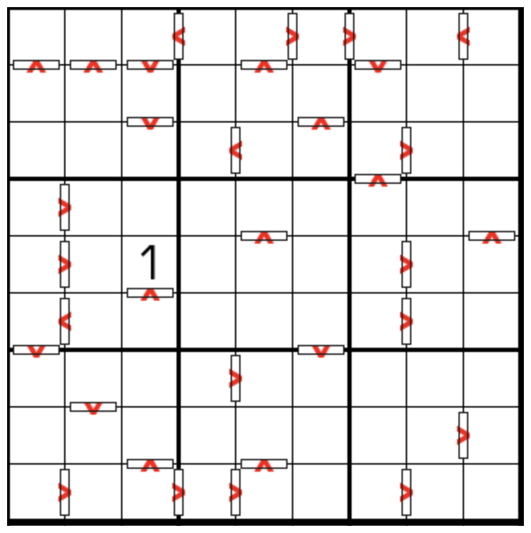

# 数比+全标连续数独

## 规则

| 序号  | 限制区域 | 限制规则                                                             | 备注  |
|:---:|:----:|:-----------------------------------------------------------------|:---:|
|  1  |  行   | [1~9填充]                                                          |     |
|  2  |  列   | [1~9填充]                                                          |     |
|  3  |  宫   | [1~9填充]                                                          |     |
|  4  | 标记边  | 标记边两侧的[共边邻格] - 差为 1（即满足[连续]约束） - 满足 `>` 的大小关系（即满足[数比]约束） | 全标  |

## 题型名

- 定向连续数独

## 题库

### 在线题库

- [独·数之道](http://www.sudokufans.org.cn/lx/game.index.php?type=cngt) 【需要登录】

[1~9填充]: ../../../rules.md#1to9填充
[共边邻格]: ../../../rules.md#共边邻格
[连续]: ../../../rules.md#连续
[数比]: ../../../rules.md#数比
