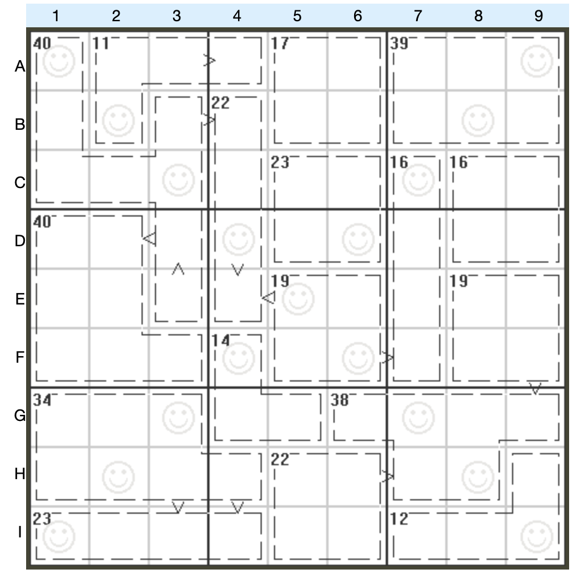

# 规则

| 序号  | 限制区域 | 限制规则                                |   备注   |
|:---:|:----:|:------------------------------------|:------:|
|  1  |  行   | [1~9填充]                             |        |
|  2  |  列   | [1~9填充]                             |        |
|  3  |  宫   | [1~9填充]                             |        |
|  4  | 对角线  | [1~9填充]                             |        |
|  5  | 标记边  | 标记边两侧的[共边邻格]满足 `>` 的大小关系（即满足[数比]约束） |   半标   |
|  6  | 计算框  | [1~9不重复] 提示数 `S`：计算框内所有数字的和为 S  | &nbsp; | 

# 题型名

- 数比对角杀手数独

[1~9填充]: ../../../rules.md#1~9填充

[1~9不重复]: ../../../rules.md#1~9不重复

[共边邻格]: ../../../rules.md#共边邻格

[数比]: ../../../rules.md#数比