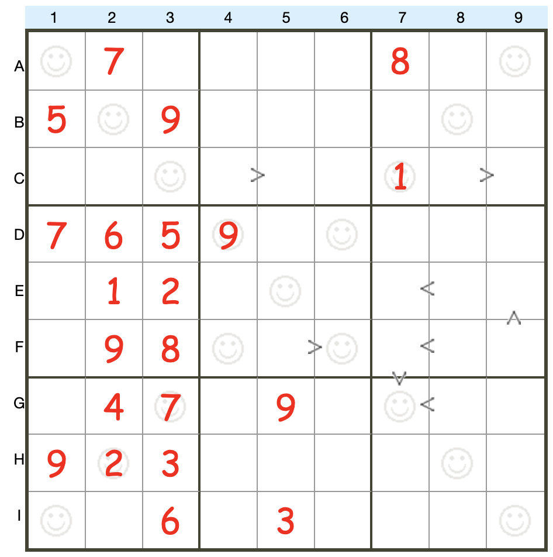

# 规则

| 序号  | 限制区域 | 限制规则                                | 备注  |
|:---:|:----:|:------------------------------------|:---:|
|  1  |  行   | [1~9填充]                             |     |
|  2  |  列   | [1~9填充]                             |     |
|  3  |  宫   | [1~9填充]                             |     |
|  4  | 对角线  | [1~9填充]                             |     |
|  5  | 标记边  | 标记边两侧的[共边邻格]满足 `>` 的大小关系（即满足[数比]约束） | 半标  |

# 题型名

- 数比对角数独

[1~9填充]: ../../../rules.md#1to9填充

[共边邻格]: ../../../rules.md#共边邻格

[数比]: ../../../rules.md#数比